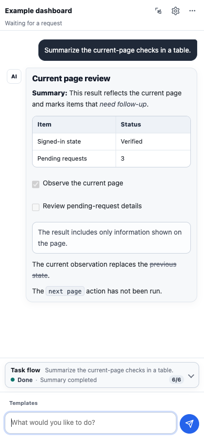
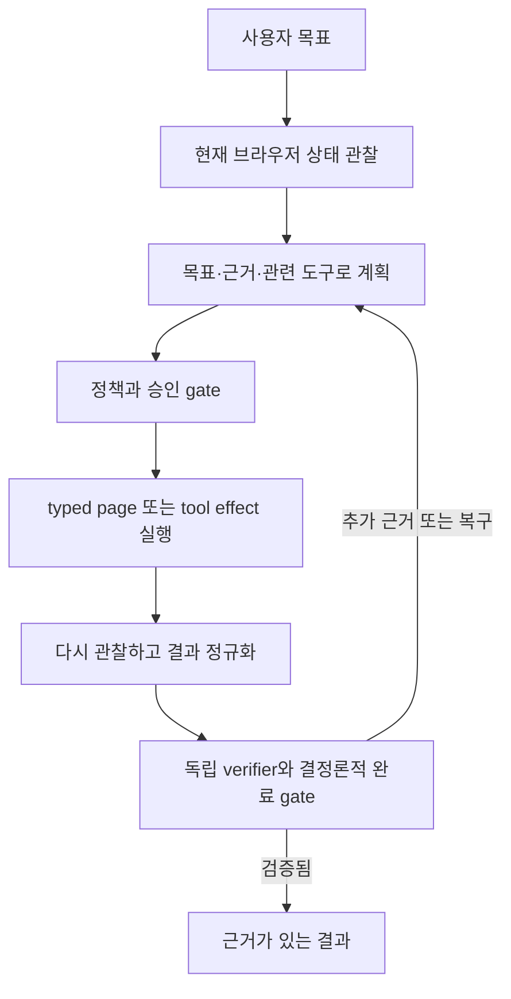
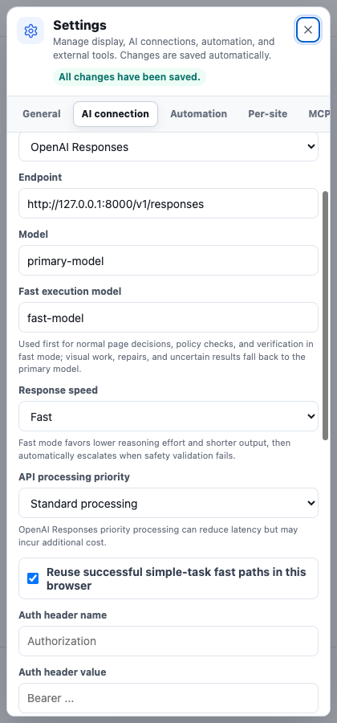
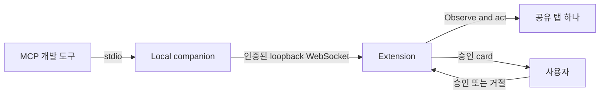

[English](README.md) | **한국어**

# My Assistant Web Plugin

> [!IMPORTANT]
> **프로젝트 상태: 종료 — 2026-07-26**
>
> 개발, 유지보수, 지원, 릴리스가 종료됐습니다. 이 저장소는 역사적 참고 자료로 남아 있으며 이후 브라우저, 모델 공급자, 의존성 변경으로 최종 빌드가 동작하지 않을 수 있습니다.

설정한 언어 모델을 범위가 제한된 브라우저 agent로 사용하는 Manifest V3 확장 프로그램입니다. 활성 페이지를 관찰하고 자연어 목표에 맞는 다음 동작을 계획하며, 승인된 도구·페이지 동작을 실행한 뒤 결과 상태를 다시 확인하고 완료를 보고합니다.



버전 `0.10.0`, Bridge protocol `2.3`은 Chromium 계열 브라우저 116 이상을 대상으로 합니다. store package가 아니라 source-loaded 개발 빌드이며 문서 화면은 임시 브라우저 profile과 로컬 fixture로 다시 생성했습니다.

## 작업 흐름 선택

| 원하는 작업 | 사용할 기능 | 모델 실행 위치 | 페이지 제어 |
| --- | --- | --- | --- |
| 확장 프로그램에서 직접 브라우저 작업 | **내장 agent** | **Settings → AI connection**의 endpoint | observe → approve → act → verify loop로 가능 |
| 로컬 MCP 개발 도구에서 현재 탭 사용 | **Local Bridge** | 외부 개발 도구, visual targeting은 확장의 설정 모델 | **Settings → Developer tools**에서 명시적으로 공유한 탭만 가능 |
| 내장 agent에서 원격 도구 서버 호출 | **Outbound MCP client** | 설정한 AI endpoint | 브라우저 직접 공유 없이 Streamable HTTP MCP 도구 호출 |

일반 내장 agent 사용에 Bridge는 필요하지 않습니다. Outbound MCP를 켠다고 개발 도구에 이 브라우저 확장이 등록되는 것도 아닙니다. 그 역할은 Bridge가 담당합니다.

## 만든 이유

고정 브라우저 자동화 script는 페이지가 예상과 다르게 움직여도 처음 목록을 반복하기 쉽고, 한 번의 prompt-response 호출은 관찰·실행·복구·증명을 소유하지 못합니다. 내장 agent는 각 요청을 durable goal로 취급하고 설정한 모델 주위에서 근거 기반 loop를 실행합니다.



모델 문장이나 오류가 없던 transport 결과만으로 완료하지 않습니다. 실행 성공, 관찰 가능한 effect, 목표 만족을 따로 추적하며 terminal response는 runtime이 발급한 근거를 인용하고 결정론적 goal gate를 만족해야 합니다.

각 실행 시도는 대상·근거 상태, 예상 변화, 관찰 결과를 ledger에 묶습니다. 변화가 없거나 불확실하거나 실패한 시도는 성공 effect로 기록하지 않고 같은 의미 근거 상태에서 반복하지 않습니다. 동일 effect를 한 번, 정확한 횟수만큼, 명시적 조건까지 허용할지 요청에서 결정하며 성공한 effect를 단순히 control이 계속 보인다는 이유로 반복하지 않습니다.

세부 state machine과 완료·복구 계약은 [Agent Runtime v2](docs/agent-runtime-v2.md), 호출 예산과 측정은 [Agent latency evaluation](docs/agent-latency-evaluation.md)을 참고하세요.

## 주요 기능

- 현재 viewport의 URL, 텍스트, control, form, table, live region 관찰
- 숨은 subtree 전체를 훑지 않는 rendered-document 대상·사실 검색
- 열린 Shadow DOM과 검증된 same-origin 또는 permission-granted frame 탐색
- nested scroll region 탐색과 대상 container scroll
- `click`, `visual_click`, `fill`, `select`, `focus`, `hover`, `submit`, `press`, `scroll`, `navigate`, `wait`, `wait_for`, `extract`, `upload`
- `tab_open`, `tab_focus`, `tab_adopt`, `tab_close`, `download`, `download_wait`
- 정확한 크기의 구조화 record 수집, pagination 간 deduplication, CSV·XLSX 로컬 내보내기
- 매 effect 전후 관찰 상태 비교와 unchanged·indeterminate·failed 반복 차단
- document·frame·node identity·mutable-state token에 묶인 element ref
- runtime-issued evidence와 MCP input schema 검증
- 읽기 전용·구조 UI 동작에는 결정론적 안전 계약, 외부 상태 변경 가능 동작에는 독립 정책 판단
- 민감하거나 외부에 보이는 effect 승인
- Streamable HTTP MCP tool·resource·prompt, protocol negotiation, session recovery
- MCP OAuth 2.1 Authorization Code + PKCE S256, refresh-token rotation
- 인증된 loopback companion을 통한 명시적 공유 탭 하나의 MCP 제어
- semantic automation·test set의 로컬 저장·가져오기·재실행
- 탭·URL별 대화 복원과 Markdown·JSON·CSV trace 내보내기
- prompt와 raw response를 제외한 개인정보 보호형 AI 요청 audit metadata
- browser-detected language, 한국어, 영어 UI 전환과 독립 AI 응답 언어 고정

## API profile

| Profile | 용도 | 구조화 응답 방식 |
| --- | --- | --- |
| OpenAI Responses | Responses 형태 endpoint와 provider-built tool | strict native planner function call, stream event, call-ID continuation, guarded JSON fallback |
| OpenAI 호환 Chat Completions | Chat Completions 호환 endpoint | `response_format.json_schema`, channel-local replay, guarded fallback |
| Anthropic 호환 Messages | Messages 형태 endpoint | channel-local replay, runtime JSON 추출·검증·repair |
| Custom JSON | 임의 HTTP JSON endpoint | 동적 template·response path mapping |

이 이름은 호환 API 형식을 고르기 위한 기술 라벨이며 제휴·후원·보증을 뜻하지 않습니다.

Custom JSON template은 `{{model}}`, `{{system}}`, `{{prompt}}`, `{{messages}}`, `{{screenshotDataUrl}}`, `{{taskType}}`, `{{responseSchema}}`를 사용할 수 있습니다.

## 빠른 시작: 내장 agent

### 요구 사항

- Chromium 계열 브라우저 116 이상
- 위 profile 중 하나와 호환되는 AI endpoint
- 구조화 JSON 결정을 안정적으로 반환하는 모델
- screenshot reasoning·visual surface 동작에는 image input 지원

확장 프로그램 사용 자체에는 Node.js가 필요하지 않습니다. Local Bridge, test, 문서 capture에는 Node.js 20 이상이 필요합니다.

### 1. 확장 프로그램 불러오기

1. 저장소를 clone 또는 내려받습니다.
2. 브라우저 extension 관리 페이지를 엽니다.
3. developer mode를 켭니다.
4. **Load unpacked**를 고릅니다.
5. `manifest.json`이 있는 저장소 루트를 선택합니다.
6. 확장 동작을 pin하거나 선택하면 기본 작업 공간이 side panel에 열립니다.

새 소스를 받은 뒤에는 extension 관리 페이지에서 **Reload**를 눌러야 합니다. source-loaded extension은 자동 갱신되지 않습니다.

### 2. 모델 연결

**Settings → AI connection**에서 API format, endpoint URL, model, 인증 header, 응답 속도, 선택적 fast execution model, local semantic route 재사용, API processing priority, Responses streaming, 필요 시 custom request template과 response path를 설정한 뒤 **Connection test**를 실행합니다.

인증 값은 기본적으로 session에만 있고 사용자가 persistent storage를 명시적으로 켰을 때만 저장합니다. visual targeting을 사용할 경우 screenshot을 켜고 모델의 image input 지원을 확인하세요.



### 3. 작업 실행과 확인

1. 일반 웹 페이지를 연 뒤 extension을 엽니다.
2. 원하는 결과·근거까지 포함한 완전한 goal을 입력합니다.
3. 상태 변경, 민감, 외부 공개 effect의 승인 card를 검토합니다.
4. 실행 중 대상 탭을 유지합니다.
5. 최종 답변과 composer 위 **Task flow**를 확인합니다. 다시 관찰해 근거가 검증된 뒤에만 완료됩니다.

반복 작업은 “다음 3개 행” 또는 “대기 행이 없을 때까지”처럼 숫자나 관찰 가능한 중지 조건을 작성하세요. 명시하지 않으면 같은 성공 상태 변경은 요청당 한 번으로 제한됩니다.

record 요청에는 정확한 unique record 수, `1~3 page` 같은 inclusive page 범위 또는 둘 다, 필요한 field와 포함·제외 규칙을 지정하세요. count는 출력 cardinality이고 page 범위는 source coverage이므로 서로 변환하지 않습니다.

## 언어와 작업 공간

**Settings → General → Display language**에서 browser language, Korean, English를 선택할 수 있습니다. 선택은 즉시 panel, settings, approval, runtime 상태, 기본 template에 적용됩니다.

**AI response language**는 별도 한국어·영어 설정이며 요청마다 runtime 계약으로 고정합니다. 모델 설명, 진행, 계획, action 이유, 검증, 최종 답변을 검사하고 언어가 명백히 바뀌면 제한된 repair를 사용합니다. 사용자 입력, 인용한 페이지, 이름, URL, 파일명, code, tool ID는 원래 형태를 유지합니다.

작업 공간은 지속적인 관찰·승인에 적합한 **Side panel** 또는 더 넓은 **Independent tab**을 사용할 수 있습니다. toolbar popup은 focus를 잃으면 닫혀 durable 상태에 맞지 않아 제공하지 않습니다.

## MCP 연결과 Local Bridge

브라우저 extension은 local stdio process를 직접 시작할 수 없으므로 outbound MCP에는 Streamable HTTP endpoint 또는 gateway가 필요합니다. remote OAuth·MCP는 HTTPS, loopback 개발 endpoint는 HTTP를 허용합니다. OAuth token은 session storage에만 있고 panel state, model prompt, trace에 넣지 않습니다.

Local Bridge는 MCP 호환 개발 도구가 사용자가 명시적으로 공유한 브라우저 탭 하나를 조작하게 합니다. raw browser debugging port를 노출하지 않고 extension이 관찰, redaction, validation, approval, execution, verification을 계속 담당합니다.



Node.js 20 이상, 활성화된 extension, local stdio server를 시작할 수 있는 MCP client, loopback 연결이 필요합니다. stdio가 권장 방식이며 client가 companion을 child process로 시작·중지합니다. 전체 설정과 문제 해결은 [Local MCP companion](docs/bridge.md), 웹 구조 경계는 [Web structure compatibility](docs/web-compatibility.md)를 참고하세요.

Browser effect 승인은 개발 도구의 MCP tool call 승인과 별개입니다. 개발 도구의 승인이 extension 정책을 우회하지 않습니다. 승인 대기 중에는 extension에서 정확한 대상·동작·이유를 확인해 승인 또는 거절한 뒤 같은 task에서 `browser_continue`로 결과를 읽어야 합니다.

## 권한

| 권한 | 유형 | 목적 |
| --- | --- | --- |
| `activeTab` | 필수 | 사용자가 task를 시작한 탭으로 접근 제한 |
| `debugger` | 필수 | 승인 대상 탭에 browser-native input을 보내고 즉시 detach |
| `scripting` | 필수 | 승인 탭에 관찰·동작 code 주입 |
| `sidePanel` | 필수 | agent UI 표시 |
| `storage` | 필수 | settings, conversation, trace 저장 |
| `tabs` | 필수 | 대상 탭 고정과 명시적 tab tool |
| `webNavigation` | 필수 | frame identity 탐색과 document binding |
| `downloads` | 선택 | 승인 download 시작·완료 확인 |
| `identity` | 선택 | MCP OAuth PKCE authorization |
| 현재 site origin | 선택 | 사용자가 고른 site 관찰·상호작용 |
| 보이는 embedded site origin | 선택 | 허용 후 노출된 cross-origin frame 관찰 |
| 설정 endpoint origin | 선택 | 사용자 설정 AI·MCP endpoint 호출 |

운영 manifest는 `<all_urls>`를 요구하지 않습니다. 필요할 때만 site·endpoint origin을 요청합니다.

## 안전과 개인정보

- page text, DOM label, MCP result·resource·prompt는 신뢰하지 않는 데이터입니다.
- 일반 관찰에서 offscreen, clipped, 완전 가림·투명·숨김 DOM을 제외합니다.
- 모델은 현재 관찰에 있는 element ref와 tool만 사용할 수 있습니다.
- 각 실행은 정확한 tab과 document identity에 고정됩니다.
- Bridge는 명시적으로 공유한 탭만 접근하고 detach하면 active session을 닫습니다.
- target precondition을 승인 직전에 다시 확인하며 stale target은 실행하지 않습니다.
- submit, external navigation, upload, tab change, download, destructive MCP tool은 자동 mode에서도 승인받습니다.
- visual coordinate 동작은 최신 screenshot, 명시적 승인, stable surface identity, 독립 verifier가 필요합니다.
- password, token, card, verification code, 민감 URL parameter를 차단하거나 가립니다.
- Bridge screenshot에는 공유 탭의 실제 pixel이 들어갈 수 있으므로 필요한 경우에만 요청합니다.
- upload는 사용자가 파일을 고른 뒤에만 전달하고 conversation·trace·settings에 저장하지 않습니다.
- audit log에는 prompt, raw response body, 인증 header 값을 넣지 않습니다.
- usable output이 없는 HTTP success는 실패로 처리합니다.

내보낸 trace와 audit log에도 페이지 정보가 남을 수 있으므로 공유 전에 검토하세요.

## 제한

- 브라우저 내부·정책 제한 page와 닫힌 Shadow DOM은 사용할 수 없습니다.
- canvas·application surface는 제한된 visual targeting을 지원하지만 모호한 대상, CAPTCHA, trusted-event 확인, site별 anti-automation은 사용자 조작이 필요할 수 있습니다.
- 임의 local file 접근이나 native shell 실행을 제공하지 않습니다.
- 외부 제어에는 실행 중 companion, 인증 extension 연결, 명시적 공유 탭이 필요합니다.
- 실제 user gesture가 필요한 permission, popup, payment 흐름은 직접 조작이 필요할 수 있습니다.
- 모델 품질, 서비스 가용성, 가격, 데이터 정책은 설정한 endpoint 공급자에 달려 있습니다.

## 개발과 검증

Node.js 20 이상이 필요합니다.

```bash
npm run check
npm test
npm run test:bridge
npm run test:e2e
npm run capture:docs
```

`npm run serve:test`로 local panel harness를 실행할 수 있습니다. 영문 README에는 선택적인 로컬 CLI·live site harness와 전체 검증 범위가 자세히 기록되어 있습니다.

## 공개 릴리스 감사

저장소는 공개 전 2026-07-23에 다시 감사했습니다. 제3자 제품을 project identity로 사용하지 않고 logo·font·minified bundle·vendor source를 포함하지 않으며, 흔한 API key·access token·private key 형식과 local absolute path·editor workspace·machine-specific 설정을 추적하지 않는지 확인했습니다. 문서 화면은 임시 fixture profile에서 생성했습니다.

이는 저장소 내용의 engineering audit이며 법률 자문이나 비침해 보증이 아닙니다. 의존성, 소스, 이미지, icon, font를 추가할 때 license·notice 검사를 다시 실행해야 합니다.

## 라이선스 상태

현재 오픈 소스 라이선스를 부여하지 않았고 `package.json`은 `UNLICENSED`입니다. 저장소 공개만으로 플랫폼 약관과 저작권법이 제공하는 범위를 넘어 사용·복사·수정·배포 권리가 생기지 않습니다.
