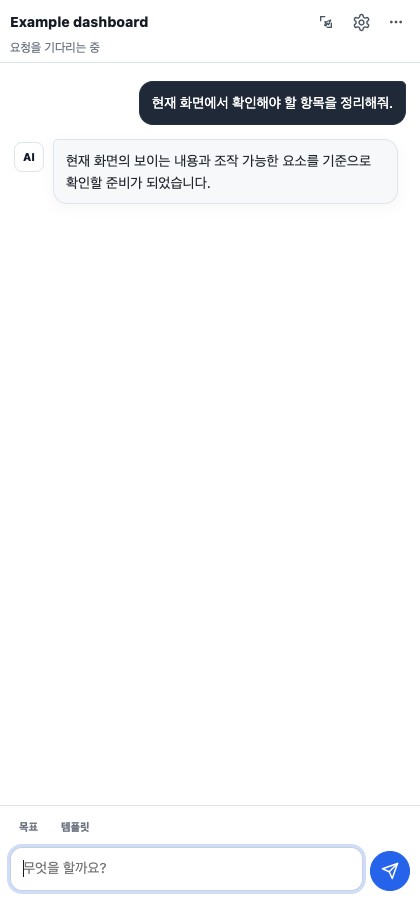
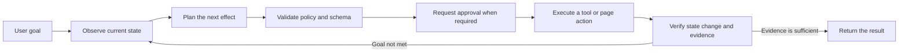
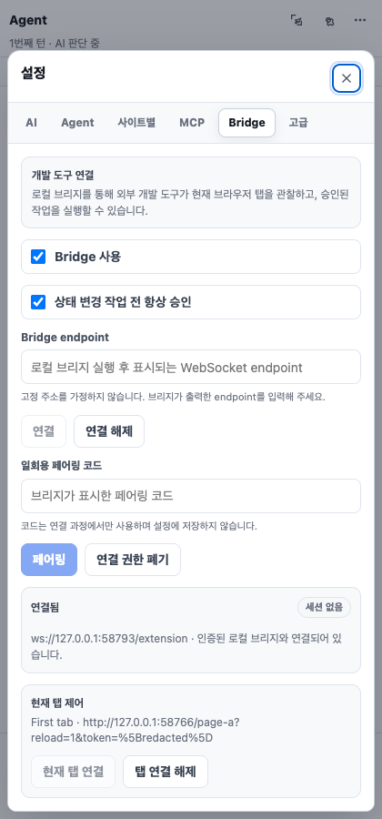
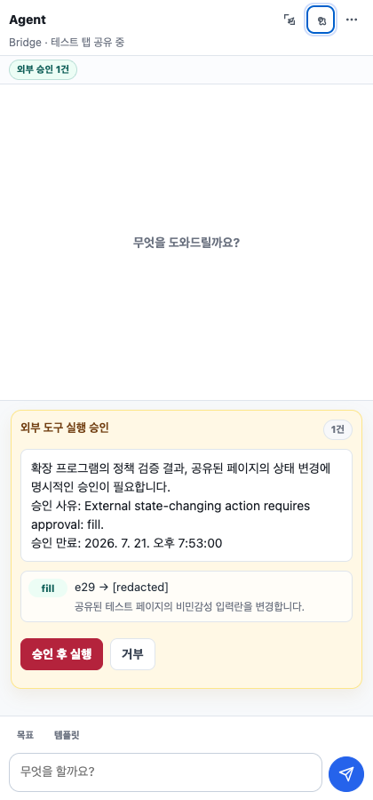

# My Assistant Web Plugin

A Manifest V3 browser extension that observes the active page, plans the next action for a natural-language goal, executes approved tools or page actions, and verifies the resulting state.



Version `0.4.0` targets Chromium-based browsers version 116 or later. This repository contains a source-loaded development build rather than a store package.

## Why this project exists

Fixed browser automation scripts often keep replaying an initial action list even after the page behaves differently than expected. This extension uses a closed feedback loop: it observes the page again after each effect, validates the next decision, requests approval when required, and checks whether the expected change actually happened.



Completion is not accepted from model prose alone. The runtime issues evidence identifiers, and a separate verifier checks the completion claim against that evidence. When the same decision repeats without observable progress, the agent tries an alternative approach and eventually stops with a concrete blocker instead of looping indefinitely.

## Capabilities

- Observes the URL and only the text, controls, forms, tables, and live regions that are visually exposed in the current viewport
- Traverses open Shadow DOM and same-origin frames
- Supports `click`, `fill`, `select`, `focus`, `hover`, `submit`, `press`, `scroll`, `navigate`, `wait`, `wait_for`, `extract`, and `upload`
- Recognizes semantic controls and visible custom pointer controls, then sends a pointer/mouse sequence before click activation
- Supports `tab_open`, `tab_focus`, `tab_adopt`, `tab_close`, `download`, and `download_wait`
- Waits for element state, text, URL, title, live-region, and DOM-stability conditions
- Compares observable state before and after every effect
- Validates element references, runtime-issued evidence, and MCP input schemas
- Runs an independent policy decision before execution
- Requires approval for sensitive or externally visible effects
- Supports Streamable HTTP MCP tools, resources, prompts, protocol negotiation, and session recovery
- Supports MCP OAuth 2.1 Authorization Code with PKCE S256 and refresh-token rotation
- Exposes one explicitly shared tab to MCP-capable development tools through an authenticated loopback companion
- Restores conversations by tab and URL and exports traces as Markdown, JSON, or CSV
- Records privacy-preserving AI request audit metadata
- Treats an HTTP success with no usable output as an explicit failure

## API profiles

| Profile | Purpose | Structured response strategy |
| --- | --- | --- |
| OpenAI Responses | Responses-format endpoints and provider-built tools | `text.format` JSON Schema with a guarded compatibility fallback |
| OpenAI-compatible Chat Completions | Chat Completions-compatible endpoints | `response_format.json_schema` with a guarded compatibility fallback |
| Anthropic-compatible Messages | Messages-format endpoints | Runtime JSON extraction, validation, and repair |
| Custom JSON | Arbitrary HTTP JSON endpoints | Dynamic template and response-path mapping |

These names are technical compatibility labels that help users choose the correct API format. They are not part of the project name or logo and do not imply affiliation, sponsorship, or endorsement.

Custom JSON templates may use the following values:

```text
{{model}}
{{system}}
{{prompt}}
{{messages}}
{{screenshotDataUrl}}
{{taskType}}
{{responseSchema}}
```

When `Response path` is empty, the extension dynamically inspects common response structures for usable text.

## Installation

1. Clone or download the repository.
2. Open the extension management page in a supported Chromium-based browser.
3. Enable developer mode.
4. Choose **Load unpacked**.
5. Select the repository root.
6. Select the extension action to open the side panel.

In the **AI** settings tab, configure the API format, endpoint, model, and authentication header. Authentication values are session-only by default and are persisted only when the user explicitly enables persistent storage.

## Using the panel controls

The panel keeps only the current page, element picker, settings, and request composer visible. Less frequent actions such as context inspection, undo, export, and clearing the conversation are under **더보기**. Manual context refresh is available inside the context dialog, where it is relevant, rather than as a duplicate toolbar action. The layout has no fixed desktop minimum width, so browser zoom and narrow side panels keep the primary actions and send control inside the viewport; long page and status labels use an ellipsis while their full text remains available as a tooltip.

**Task goal** is persistent guidance for the current tab and URL, not a command that starts work. Open **목표** above the composer, enter the scope or completion criteria that should carry across several messages, select **고정**, and then send individual requests. A pinned goal becomes read-only until **수정** is selected. Clearing the conversation keeps the pinned goal; **해제** removes it. The latest message still takes priority when it narrows or updates the goal.

**Templates** are reusable request text, not an automatic workflow. Open **템플릿** above the composer, choose a template, select **불러오기**, review or edit the inserted text, and then send it. Loading a template preserves the existing draft and inserts the template at the current cursor or selection. **현재 문구 저장** stores the composer text as a personal template.

Global settings are saved when a field changes, so there is no separate global save button; site-specific profiles still use their own apply action. The full reset action is under **Settings → 고급**. While a local action plan is waiting for approval, the new-request composer is hidden because the running task cannot accept another request; rejecting or completing the approval restores the unchanged draft. External Bridge approvals do not hide the composer.

**Settings → 사이트별** is an agent-behavior profile for the exact origin shown in the panel; it does not change browser permissions. Enable the profile only when that site needs different behavior. Each field can independently inherit the global setting or override the action mode, screenshot use, and MCP use for that origin. The effective values are shown before saving, and **기본 설정으로 되돌리기** removes the origin-specific profile.

The screenshot switch covers both screenshots sent with AI decisions and target previews shown in approval cards. A site-specific screenshot override takes precedence over the global switch. Turning screenshots off does not disable DOM-based viewport observation; visible text and controls are still collected subject to the privacy filters and configured limits.

## MCP connections

Browser extensions cannot start local stdio processes directly, so MCP integration requires a Streamable HTTP endpoint or gateway.

- `auto` protocol version starts with a supported stable version and follows the server-negotiated version afterward.
- An empty allowlist exposes the tools reported by the endpoint as dynamic candidates.
- Tool arguments are validated against each tool's `inputSchema` before execution.
- `destructiveHint`, `readOnlyHint`, and `openWorldHint` annotations affect warnings and approval requirements.
- Remote OAuth and MCP endpoints must use HTTPS; loopback development endpoints may use HTTP.
- OAuth access and refresh tokens remain in session storage and are not included in panel state, model prompts, or traces.

This is the extension's outbound MCP client. To let an MCP-capable local development tool control a tab through this extension, use the separate local companion described below.

## External developer-tool bridge

The companion exposes a bearer-authenticated Streamable HTTP MCP endpoint on loopback and relays validated requests to the extension over a separately authenticated WebSocket. It chooses an available port at startup unless a port is supplied, so copy the endpoints from the current startup output instead of assuming a fixed address.

```bash
pnpm install
node bridge/server.mjs
```

The command prints an MCP endpoint and bearer token for the development tool, plus an extension endpoint and short-lived one-time code for pairing the browser extension. These four values have different purposes and must not be interchanged.

In the side panel, open **Settings → Bridge**, paste the printed extension endpoint and pairing code, select **페어링 (Pair)**, then select **현재 탭 연결 (Connect current tab)** while the intended page is active. An MCP client can then start a short-lived session, observe that tab, and propose actions. Actions that need approval appear in the extension, where the user can review and approve or reject them. The extension observes the page again and validates target preconditions immediately before an approved effect.

| Pair and share one tab | Review a state-changing proposal |
| --- | --- |
|  |  |

Both screenshots are generated by `pnpm run capture:docs` against a temporary browser profile and a local fixture. They contain no user session, private page, persistent credential, or machine-specific path.

See [Local MCP companion](docs/bridge.md) for complete startup options, portable MCP client configuration patterns, the tool workflow, security properties, and troubleshooting.

## Permissions

| Permission | Type | Purpose |
| --- | --- | --- |
| `activeTab` | Required | Restricts page access to the tab where the user starts a task |
| `scripting` | Required | Injects observation and action code into an approved tab |
| `sidePanel` | Required | Displays the agent interface |
| `storage` | Required | Stores settings, conversations, and traces |
| `tabs` | Required | Pins the target tab and runs explicit tab tools |
| `downloads` | Optional | Starts an approved download and checks its completion state |
| `identity` | Optional | Runs MCP OAuth PKCE authorization |
| Current site origin | Optional | Observes and interacts with the site selected by the user |
| Configured endpoint origin | Optional | Calls an AI or MCP endpoint configured by the user |

The production manifest does not require `<all_urls>`. Site and endpoint origins are requested only when a connection test or task needs them.

## Safety and privacy

- Page text, DOM labels, MCP results, resources, and prompts are treated as untrusted data.
- Offscreen, clipped, fully occluded, fully transparent, and hidden DOM content is excluded from model-visible page observations until it is revealed and observed again.
- The model can use only element references and tools present in the current observation.
- Each run is pinned to an exact tab and document identity.
- External development tools can access only the tab explicitly shared in the Bridge panel, and detaching it closes their active sessions.
- The local companion binds only to loopback, requires independent MCP and extension credentials, and never puts either credential in a URL.
- URL, document identity, and target preconditions are checked again immediately before an approved effect.
- Submission, external navigation, upload, tab changes, downloads, and destructive MCP tools require approval even in automatic mode.
- Passwords, tokens, card data, verification codes, and sensitive URL parameters are blocked or masked by policy.
- Structured observations are redacted, but a Bridge screenshot contains the visible pixels of the shared tab and can include private on-screen data; request it only when the task needs visual evidence.
- Upload contents are handed off only after the user selects a file and are not persisted in conversations, traces, or settings.
- Audit logs exclude prompts, raw response bodies, and authentication header values.
- Empty successful responses fail closed instead of being presented as successful work.

### Audit logs

The audit-log view records request outcome, HTTP status, response identifier and size, output character count, latency, retries, structured-output fallback, and numeric provider usage. It does not store prompts, raw response bodies, or authentication secrets.

Exported traces and audit logs may still contain page-derived information. Review exported files before sharing them.

## Limitations

- Browser-internal pages, policy-restricted pages, closed Shadow DOM, and cross-origin frame contents cannot be inspected or controlled. Cross-origin frames are reported as metadata-only so the agent can explain the boundary instead of pretending to have read them.
- Canvas-only controls, browser UI requiring a trusted user gesture, and controls hidden behind page-specific anti-automation behavior may still require direct user interaction.
- The extension does not provide arbitrary local-file access or native shell execution.
- External control requires the local companion process to remain running, an authenticated extension connection, and an explicitly shared tab.
- Browser UI that requires a real user gesture, including some permission, popup, or payment flows, may require direct user interaction.
- Model quality, service availability, pricing, and external data-handling policies depend on the configured endpoint provider.

## Development and verification

Node.js 20 or later is required.

```bash
pnpm run check
pnpm test
pnpm run test:bridge
pnpm run test:e2e
# Optional: requires a compatible local CLI already routed to a vLLM endpoint.
LOCAL_HARNESS_BIN="<COMPATIBLE_CLI>" pnpm run test:e2e:local-harness
# Regenerates the privacy-safe documentation screenshots from a temporary profile.
pnpm run capture:docs
```

Run the local panel harness with:

```bash
pnpm run serve:test
```

The command reports the temporary development address. The E2E suite exercises the Manifest V3 service worker, content injection, document replacement, viewport-scoped deep DOM observation, occlusion and clipping filters, custom pointer clicks, scrolling, live-region waiting, file handoff, tab lifecycle, worker restart, and empty-response protection. The opt-in local-harness scenario additionally launches a compatible CLI, loads a temporary secret-protected MCP configuration, confirms that every assistant turn reports the local `default` model alias, and requires the model to complete the full status → session → observation → approved action → verification → close workflow against a temporary browser profile.

## Public-release audit

The repository was re-audited on 2026-07-21 before publication.

- No third-party product is used as the project identity, name, or logo.
- No third-party logos, fonts, minified bundles, or vendored source are included.
- Companion runtime dependencies are pinned in `package.json` and `pnpm-lock.yaml`. The current production tree has 92 uniquely named packages under MIT, BSD-2-Clause, BSD-3-Clause, or ISC terms, no package with a missing license declaration, and no known production vulnerability reported by the package-manager audit. See [Dependency license audit](docs/dependency-licenses.md).
- No common API key, access token, or private-key format is present.
- No local absolute path, editor workspace, or machine-specific configuration is tracked.
- API and browser names appear only where needed to describe protocol compatibility and installation; product-specific development-harness names are not included.
- Documentation captures come from a temporary fixture profile and contain no signed-in session or persistent credential.

This is an engineering audit of the repository contents, not legal advice or a warranty of non-infringement. Re-run the audit, including dependency license and notice requirements, whenever packages, source code, images, icons, or fonts are added.

OpenAI, Anthropic, Chrome, Chromium, Edge, and any other referenced names may be trademarks of their respective owners. All trademarks belong to their owners. This project is not affiliated with, sponsored by, or endorsed by those owners unless explicitly stated otherwise.

## License status

No open-source license is currently granted. `package.json` therefore declares `UNLICENSED`. Making the repository public does not by itself grant permission to use, copy, modify, or distribute the project beyond rights provided by applicable platform terms and copyright law.

If open-source distribution is intended, the rights holder should select a `LICENSE` after considering the desired permissions, patent terms, and notice obligations. See [GitHub's repository licensing guidance](https://docs.github.com/en/repositories/managing-your-repositorys-settings-and-features/customizing-your-repository/licensing-a-repository) for background.
