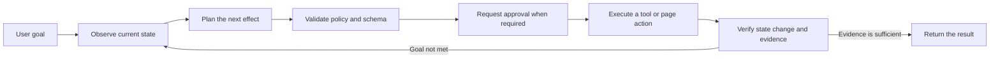

# My Assistant Web Plugin

A Manifest V3 browser extension that observes the active page, plans the next action for a natural-language goal, executes approved tools or page actions, and verifies the resulting state.


Version `0.3.1` targets Chromium-based browsers version 116 or later. This repository contains a source-loaded development build rather than a store package.

## Why this project exists

Fixed browser automation scripts often keep replaying an initial action list even after the page behaves differently than expected. This extension uses a closed feedback loop: it observes the page again after each effect, validates the next decision, requests approval when required, and checks whether the expected change actually happened.



Completion is not accepted from model prose alone. The runtime issues evidence identifiers, and a separate verifier checks the completion claim against that evidence. When the same decision repeats without observable progress, the agent tries an alternative approach and eventually stops with a concrete blocker instead of looping indefinitely.

## Capabilities

- Observes the URL, visible text, DOM structure, forms, tables, live regions, and the current viewport screenshot
- Traverses open Shadow DOM and same-origin frames
- Supports `click`, `fill`, `select`, `focus`, `hover`, `submit`, `press`, `scroll`, `navigate`, `wait`, `wait_for`, `extract`, and `upload`
- Supports `tab_open`, `tab_focus`, `tab_adopt`, `tab_close`, `download`, and `download_wait`
- Waits for element state, text, URL, title, live-region, and DOM-stability conditions
- Compares observable state before and after every effect
- Validates element references, runtime-issued evidence, and MCP input schemas
- Runs an independent policy decision before execution
- Requires approval for sensitive or externally visible effects
- Supports Streamable HTTP MCP tools, resources, prompts, protocol negotiation, and session recovery
- Supports MCP OAuth 2.1 Authorization Code with PKCE S256 and refresh-token rotation
- Restores conversations by tab and URL and exports traces as Markdown, JSON, or CSV
- Records privacy-preserving AI request audit metadata
- Treats an HTTP success with no usable output as an explicit failure

## API profiles

| Profile | Purpose | Structured response strategy |
| --- | --- | --- |
| OpenAI Responses | Responses-format endpoints and provider-built tools | `text.format` JSON Schema with a guarded compatibility fallback |
| OpenAI-compatible Chat Completions | Chat Completions-compatible endpoints | `response_format.json_schema` with a guarded compatibility fallback |
| Anthropic-compatible Messages | Messages-format endpoints | Runtime JSON extraction, validation, and repair |
| Custom JSON | Arbitrary HTTP JSON endpoints | Dynamic template and response-path mapping |

These names are technical compatibility labels that help users choose the correct API format. They are not part of the project name or logo and do not imply affiliation, sponsorship, or endorsement.

Custom JSON templates may use the following values:

```text
{{model}}
{{system}}
{{prompt}}
{{messages}}
{{screenshotDataUrl}}
{{taskType}}
{{responseSchema}}
```

When `Response path` is empty, the extension dynamically inspects common response structures for usable text.

## Installation

1. Clone or download the repository.
2. Open the extension management page in a supported Chromium-based browser.
3. Enable developer mode.
4. Choose **Load unpacked**.
5. Select the repository root.
6. Select the extension action to open the side panel.

In the **AI** settings tab, configure the API format, endpoint, model, and authentication header. Authentication values are session-only by default and are persisted only when the user explicitly enables persistent storage.

## MCP connections

Browser extensions cannot start local stdio processes directly, so MCP integration requires a Streamable HTTP endpoint or gateway.

- `auto` protocol version starts with a supported stable version and follows the server-negotiated version afterward.
- An empty allowlist exposes the tools reported by the endpoint as dynamic candidates.
- Tool arguments are validated against each tool's `inputSchema` before execution.
- `destructiveHint`, `readOnlyHint`, and `openWorldHint` annotations affect warnings and approval requirements.
- Remote OAuth and MCP endpoints must use HTTPS; loopback development endpoints may use HTTP.
- OAuth access and refresh tokens remain in session storage and are not included in panel state, model prompts, or traces.

## Permissions

| Permission | Type | Purpose |
| --- | --- | --- |
| `activeTab` | Required | Restricts page access to the tab where the user starts a task |
| `scripting` | Required | Injects observation and action code into an approved tab |
| `sidePanel` | Required | Displays the agent interface |
| `storage` | Required | Stores settings, conversations, and traces |
| `tabs` | Required | Pins the target tab and runs explicit tab tools |
| `downloads` | Optional | Starts an approved download and checks its completion state |
| `identity` | Optional | Runs MCP OAuth PKCE authorization |
| Current site origin | Optional | Observes and interacts with the site selected by the user |
| Configured endpoint origin | Optional | Calls an AI or MCP endpoint configured by the user |

The production manifest does not require `<all_urls>`. Site and endpoint origins are requested only when a connection test or task needs them.

## Safety and privacy

- Page text, DOM labels, MCP results, resources, and prompts are treated as untrusted data.
- The model can use only element references and tools present in the current observation.
- Each run is pinned to an exact tab and document identity.
- URL, document identity, and target preconditions are checked again immediately before an approved effect.
- Submission, external navigation, upload, tab changes, downloads, and destructive MCP tools require approval even in automatic mode.
- Passwords, tokens, card data, verification codes, and sensitive URL parameters are blocked or masked by policy.
- Upload contents are handed off only after the user selects a file and are not persisted in conversations, traces, or settings.
- Audit logs exclude prompts, raw response bodies, and authentication header values.
- Empty successful responses fail closed instead of being presented as successful work.

### Audit logs

The audit-log view records request outcome, HTTP status, response identifier and size, output character count, latency, retries, structured-output fallback, and numeric provider usage. It does not store prompts, raw response bodies, or authentication secrets.

Exported traces and audit logs may still contain page-derived information. Review exported files before sharing them.

## Limitations

- Browser-internal pages, policy-restricted pages, closed Shadow DOM, and cross-origin frame contents cannot be inspected or controlled.
- The extension does not provide arbitrary local-file access or native shell execution.
- Browser UI that requires a real user gesture, including some permission, popup, or payment flows, may require direct user interaction.
- Model quality, service availability, pricing, and external data-handling policies depend on the configured endpoint provider.

## Development and verification

Node.js 20 or later is required.

```bash
pnpm run check
pnpm test
pnpm run test:e2e
```

Run the local panel harness with:

```bash
pnpm run serve:test
```

The command reports the temporary development address. The E2E suite exercises the Manifest V3 service worker, content injection, document replacement, deep DOM observation, live-region waiting, file handoff, tab lifecycle, worker restart, and empty-response protection.

## Public-release audit

The repository was re-audited on 2026-07-18 before publication.

- No third-party product is used as the project identity, name, or logo.
- No third-party logos, fonts, minified bundles, or vendored source are included.
- There are no runtime, development, or optional package dependencies.
- No common API key, access token, or private-key format is present.
- No local absolute path, editor workspace, or machine-specific configuration is tracked.
- API and browser names appear only where needed to describe compatibility and installation.
- The public branch is a single privacy-safe root commit with no prior repository history.

No third-party notice requirement was identified in the code and assets currently included in the repository. This is an engineering audit of the repository contents, not legal advice or a warranty of non-infringement. Re-run the audit whenever packages, source code, images, icons, or fonts are added.

OpenAI, Anthropic, Chrome, Chromium, Edge, and any other referenced names may be trademarks of their respective owners. All trademarks belong to their owners. This project is not affiliated with, sponsored by, or endorsed by those owners unless explicitly stated otherwise.

## License status

No open-source license is currently granted. Making the repository public does not by itself grant permission to use, copy, modify, or distribute the project beyond rights provided by applicable platform terms and copyright law.

If open-source distribution is intended, the rights holder should select a `LICENSE` after considering the desired permissions, patent terms, and notice obligations. See [GitHub's repository licensing guidance](https://docs.github.com/en/repositories/managing-your-repositorys-settings-and-features/customizing-your-repository/licensing-a-repository) for background.
