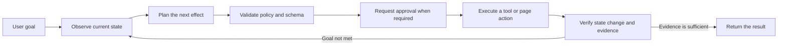
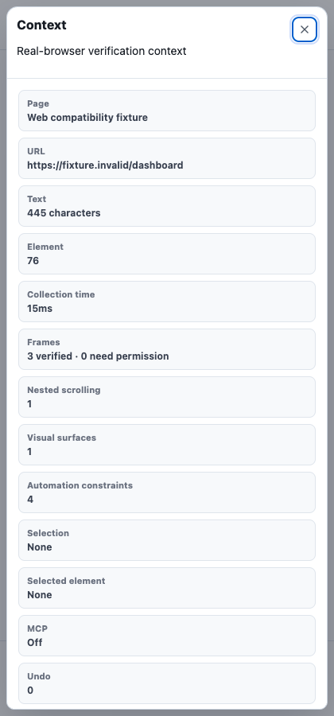
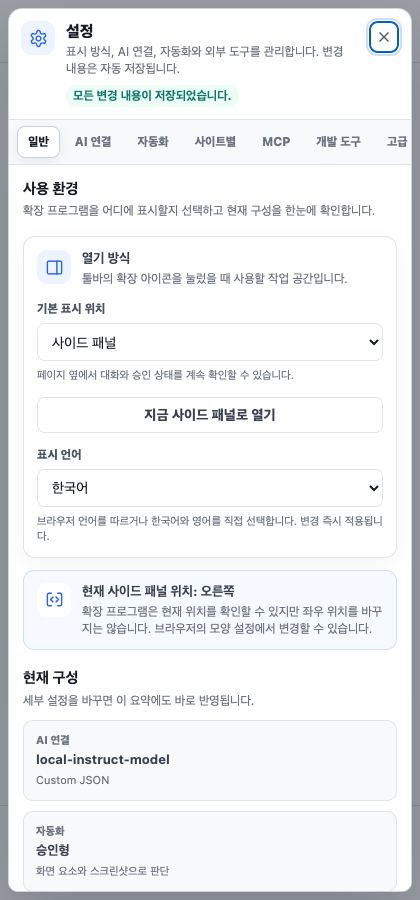
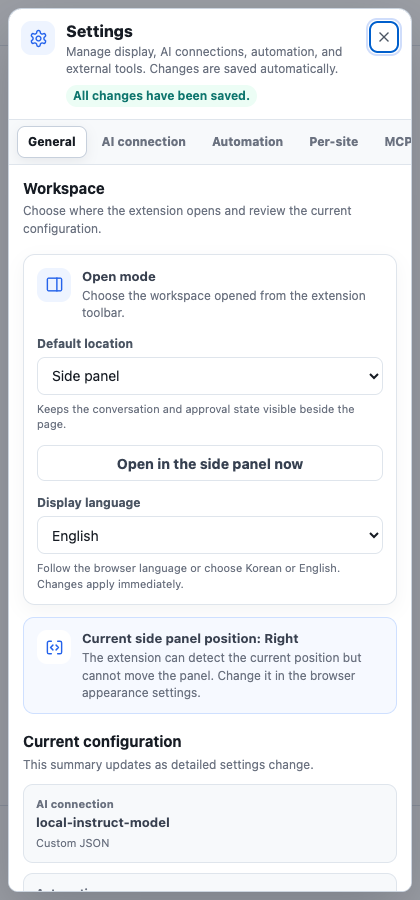
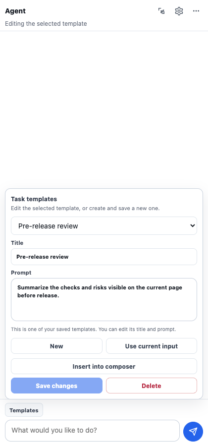
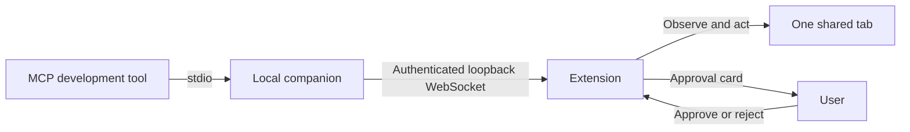
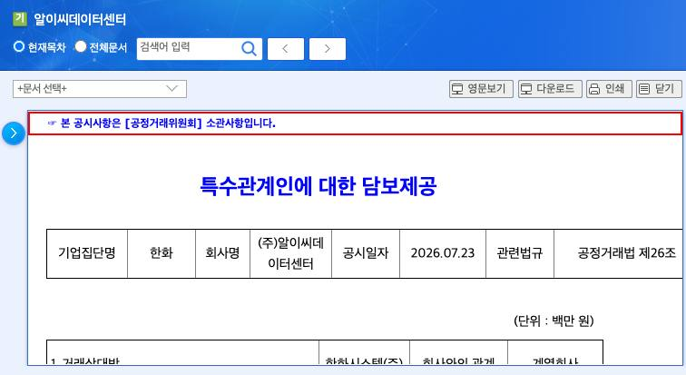

# My Assistant Web Plugin

A Manifest V3 browser extension that turns a configured language model into a bounded browser agent. It observes the active page, plans the next action for a natural-language goal, executes approved tools or page actions, and verifies the resulting state before reporting completion.


Version `0.9.6` with Bridge protocol `2.3` targets Chromium-based browsers version 116 or later. This repository contains a source-loaded development build rather than a store package. The screenshots in this README were regenerated from the current version with a temporary browser profile and local fixtures.

## Choose the workflow

The extension has three related but distinct integration paths:

| What you want to do | Use | Where the model runs | Does it control the page? |
| --- | --- | --- | --- |
| Give browser tasks directly in the extension | **Built-in agent** | At the AI endpoint configured in **Settings → AI 연결** | Yes, through the extension's observe → approve → act → verify loop |
| Let a local MCP-capable development tool use the current browser tab | **Local Bridge** | In the external development tool; visual targeting uses the extension's configured model | Yes, but only for the tab explicitly shared in **Settings → 개발 도구** |
| Let the built-in agent call a remote tool server | **Outbound MCP client** | At the configured AI endpoint | No direct browser sharing; it calls the configured Streamable HTTP MCP tools |

The Bridge is not required for normal use of the built-in agent. Conversely, enabling outbound MCP does not register this browser extension in a development tool; that is the Bridge's job.

## Why this project exists

Fixed browser automation scripts often keep replaying an initial action list even after the page behaves differently than expected. This extension uses a closed feedback loop: it observes the page again after each effect, validates the next decision, requests approval when required, and checks whether the expected change actually happened.



Completion is not accepted from model prose alone. Before any page effect, the runtime resolves one immutable intent for the latest message. A complete command starts a new standalone task even when it resembles an earlier failed request; only a semantically incomplete follow-up that explicitly resumes one unfinished deliverable carries prior context forward. The runtime also resolves whether the same semantic effect is allowed once, an explicit number of times, or until an explicit condition. A successful effect cannot be repeated beyond that boundary merely because the same control remains visible. Runtime-issued evidence and separate verifiers then check both the completion claim and the exact user-facing result. A terminal response must contain the requested result rather than announce future work or merely say that a summary was produced.

The planner may cite only IDs already present in the runtime evidence ledger, but it no longer has to copy an opaque ID correctly to reach verification. An empty completion-evidence candidate proceeds to the independent verifier, which selects valid runtime-issued IDs and binds them to the decision. Unissued IDs are discarded, and the terminal state still fails closed unless the verifier returns at least one valid supporting ID. Contract diagnostics remain in the internal trace instead of being shown as a `completionEvidence` error in the conversation.

## Capabilities

- Observes the URL and only the text, controls, forms, tables, and live regions that are visually exposed in the current viewport
- Exposes dense visible controls through observation-bound windows and dynamic label/role search instead of treating the configured element count as a browser limit
- Traverses open Shadow DOM and visually verified same-origin or permission-granted cross-origin frames, while keeping every child-frame ref bound to its document
- Discovers visible nested scroll regions and scrolls the intended container before observing newly revealed controls
- Supports `click`, screenshot-bound `visual_click`, `fill`, `select`, `focus`, `hover`, `submit`, `press`, `scroll`, `navigate`, `wait`, `wait_for`, `extract`, and `upload`
- Uses visual coordinates only inside an observed canvas or application surface; coordinates are created inside the extension, require approval, and are independently verified against a fresh screenshot before execution
- Recognizes semantic controls and visible custom pointer controls, then sends a pointer/mouse sequence before click activation
- Supports `tab_open`, `tab_focus`, `tab_adopt`, `tab_close`, `download`, and `download_wait`
- Waits for element state, text, URL, title, live-region, and DOM-stability conditions
- Compares observable state before and after every effect
- Validates element references, runtime-issued evidence, and MCP input schemas
- Runs an independent policy decision before execution
- Requires approval for sensitive or externally visible effects
- Supports Streamable HTTP MCP tools, resources, prompts, protocol negotiation, and session recovery
- Supports MCP OAuth 2.1 Authorization Code with PKCE S256 and refresh-token rotation
- Exposes one explicitly shared tab to MCP-capable development tools through an authenticated loopback companion
- Freezes each latest request into a standalone or explicit-continuation intent and prevents successful effects from exceeding its resolved repetition boundary
- Restores conversations by tab and URL and exports traces as Markdown, JSON, or CSV
- Records privacy-preserving AI request audit metadata
- Treats an HTTP success with no usable output as an explicit failure
- Repairs malformed structured decisions without exposing model JSON or internal validation details in the conversation
- Renders CommonMark and GFM assistant output as structured headings, emphasis, nested and task lists, tables, quotes, code, and safe links instead of exposing source delimiters
- Switches the extension-owned interface between browser-detected language, Korean, and English without a reload

The **Context** inspector shows what the current browser observation actually contains: visible text and controls, mapped frames, nested scroll regions, visual surfaces, automation constraints, selection, and recent logs. It is useful for distinguishing a model-planning problem from a browser-permission or page-structure boundary.



## API profiles

| Profile | Purpose | Structured response strategy |
| --- | --- | --- |
| OpenAI Responses | Responses-format endpoints and provider-built tools | `text.format` JSON Schema with a guarded compatibility fallback |
| OpenAI-compatible Chat Completions | Chat Completions-compatible endpoints | `response_format.json_schema` with a guarded compatibility fallback |
| Anthropic-compatible Messages | Messages-format endpoints | Runtime JSON extraction, validation, and repair |
| Custom JSON | Arbitrary HTTP JSON endpoints | Dynamic template and response-path mapping |

These names are technical compatibility labels that help users choose the correct API format. They are not part of the project name or logo and do not imply affiliation, sponsorship, or endorsement.

Custom JSON templates may use the following values:

```text
{{model}}
{{system}}
{{prompt}}
{{messages}}
{{screenshotDataUrl}}
{{taskType}}
{{responseSchema}}
```

When `Response path` is empty, the extension dynamically inspects common response structures for usable text.

## Quick start: built-in agent

### Requirements

- Chromium-based browser version 116 or later
- An AI endpoint compatible with one of the profiles above
- A model that can reliably return structured JSON decisions
- Image input support on that endpoint only when screenshot reasoning or visual-surface actions are needed

Node.js is not required to load and use the extension itself. Node.js 20 or later is required for the local Bridge, tests, and documentation capture.

### 1. Load the extension

1. Clone or download this repository.
2. Open the browser's extension management page.
3. Enable developer mode.
4. Choose **Load unpacked**.
5. Select the repository root: the directory containing `manifest.json`.
6. Pin or select the extension action. The default workspace opens in the side panel.

After pulling a newer source revision, return to the extension management page and select **Reload** for this extension. A source-loaded extension does not update itself.

### 2. Connect a model

Open **Settings → AI 연결** and configure:

1. **API format** matching the endpoint protocol.
2. **Endpoint URL** and **Model**.
3. The authentication header name and value required by the endpoint.
4. A custom request template and response path only when using **Custom JSON**.
5. **Connection test** before starting a browser task.

Authentication values are session-only by default and are persisted only when the user explicitly enables persistent storage. The endpoint must support the selected structured-response strategy. If visual targeting is expected, enable screenshots and confirm that the selected model accepts image input.

### 3. Run and verify a task

1. Open a normal web page and then open the extension.
2. Enter a complete goal, including the result or evidence you expect.
3. Review approval cards for state-changing, sensitive, or externally visible effects.
4. Keep the target tab open while the task runs.
5. Check the final answer and **작업 흐름** card. A task is complete only after the extension has re-observed the result and verified the returned evidence.

The agent can dynamically request another visible-control window with a `discover` decision. It searches accessible labels, roles, safe attributes, and nearby table/row/form/dialog/region text locally, similar to using a targeted source search instead of loading an entire file. Only matched control descriptors are sent to the model. If the target is outside the viewport, the agent must scroll and observe again; local search does not expose offscreen or hidden content.

Write a numeric count or an observable stopping condition when an action genuinely needs repetition, for example “apply this to the next three rows” or “continue until no pending rows remain.” Without that explicit scope, the same successful state-changing effect is limited to one occurrence in the request. If a task ends with an error, rejection, or cancellation, send the next complete request as a new task; the failed run is retained as context but is not treated as permission to replay its actions.

## Settings and workspace placement

The settings dialog starts with a live overview of the model, automation mode, external integrations, and workspace placement. Fields continue to save automatically, and the header reports completed saves or validation errors without requiring a separate global save button.



### Display language

Open **Settings → General → Display language** (`설정 → 일반 → 표시 언어`) and choose:

- **Browser language** to use Korean when the browser's first preferred language is Korean and English otherwise
- **Korean** to keep the interface in Korean regardless of the browser language
- **English** to keep the interface in English regardless of the browser language

The selection is saved with the other extension settings and applies immediately to the panel, settings, approval controls, runtime status messages, and built-in task templates. Reloading the extension or target page is not required. Switching the display language does not translate user input, saved personal templates, page titles or content, or model-generated answers; those values remain byte-for-byte user or source content. The model's response language is controlled separately by the request and system instruction.



The browser action is not limited to a right-side panel:

- **Side panel** keeps the agent visible next to the page and is the default for ongoing observation and approvals.
- **Independent tab** provides more width for long conversations and configuration. A matching agent tab is reused for the same target in that browser window, while another target gets an independent workspace so an active run is not reloaded.
- Chrome controls whether its side panel appears on the left or right. The extension reads and displays the current side when that browser API is available, but it does not override the user's browser appearance preference.

A toolbar popup is technically possible, but Chrome closes it as soon as focus moves outside the popup. That lifecycle is unsuitable for persistent chat, approval, and automation state, so this project deliberately offers the two durable workspaces instead.

## Using the panel controls

The panel keeps only the current page, element picker, settings, and request composer visible. Less frequent actions such as context inspection, undo, export, and clearing the conversation are under **더보기**. Manual context refresh is available inside the context dialog, where it is relevant, rather than as a duplicate toolbar action. The layout has no fixed desktop minimum width, so browser zoom and narrow side panels keep the primary actions and send control inside the viewport; long page and status labels use an ellipsis while their full text remains available as a tooltip.

Assistant messages use a bundled GitHub-Flavored Markdown parser for syntax recognition, then build a separate allowlisted DOM tree. The renderer covers headings, paragraphs and hard breaks, bold and italic emphasis, strikethrough, escaped characters and HTML character references, ordered, unordered, nested, and task lists, block quotes, horizontal rules, inline and fenced code, tables, inline and reference links, and automatic HTTP(S) links. Tables remain semantic tables inside a keyboard-focusable horizontal scroll region, and long code blocks are keyboard-scrollable. Remote images are represented as labeled links rather than fetched automatically, while raw HTML is displayed as inert source text; unsafe link protocols are never inserted into the live DOM. User messages and extension-owned status messages remain plain text.

**Templates** are reusable request text, not an automatic workflow. Open **템플릿** above the composer to create a template or select an existing one, then edit its title and request text directly. **변경 저장** updates the selected item instead of creating a duplicate. Personal-template deletion and built-in-template restoration both use a two-step confirmation. **현재 입력 가져오기** copies the composer draft into the editor without saving it, and **입력창에 넣기** preserves the existing draft while inserting the edited template at the current cursor or selection.

Each submitted message becomes one immutable agent objective. A complete new request does not inherit unfinished effects from an earlier failed run, while an explicit continuation can reuse only the prior context needed to finish that named task. Reusable instructions belong in **템플릿**, where they remain visible and editable before being inserted into the composer; there is no hidden persistent goal that can silently broaden a later message. The Bridge still retains the explicit `goal` passed to `browser_begin` for the lifetime of that one external browser task because it is the execution and repetition boundary, not cross-message memory.



Global settings are saved when a field changes, so there is no separate global save button; site-specific profiles still use their own apply action. The full reset action is under **Settings → 고급**. While a local action plan is waiting for approval, the new-request composer is hidden because the running task cannot accept another request; rejecting or completing the approval restores the unchanged draft. External Bridge approvals do not hide the composer.

The **작업 흐름** card summarizes the complete run rather than only the final turn, so an earlier tool call or page action is not replaced with “none” when the terminal turn needs no further effect. Successful low-level result payloads stay in the internal evidence and trace instead of appearing as raw JSON chat messages. Malformed decision objects and provider error envelopes are repaired or reduced to concise user-facing errors; internal schema messages such as an invalid `elementSearch` placement remain in diagnostics instead of the conversation.

**Settings → 사이트별** is an agent-behavior profile for the exact origin shown in the panel; it does not change browser permissions. Enable the profile only when that site needs different behavior. Each field can independently inherit the global setting or override the action mode, screenshot use, and MCP use for that origin. The effective values are shown before saving, and **기본 설정으로 되돌리기** removes the origin-specific profile.

The screenshot switch covers both screenshots sent with AI decisions and target previews shown in approval cards. A site-specific screenshot override takes precedence over the global switch. Turning screenshots off does not disable DOM-based viewport observation; visible text and controls are still collected subject to the privacy filters and configured limits.

## MCP connections

Browser extensions cannot start local stdio processes directly, so MCP integration requires a Streamable HTTP endpoint or gateway.

- `auto` protocol version starts with a supported stable version and follows the server-negotiated version afterward.
- An empty allowlist exposes the tools reported by the endpoint as dynamic candidates.
- Tool arguments are validated against each tool's `inputSchema` before execution.
- `destructiveHint`, `readOnlyHint`, and `openWorldHint` annotations affect warnings and approval requirements.
- Remote OAuth and MCP endpoints must use HTTPS; loopback development endpoints may use HTTP.
- OAuth access and refresh tokens remain in session storage and are not included in panel state, model prompts, or traces.

This is the extension's outbound MCP client. To let an MCP-capable local development tool control a tab through this extension, use the separate local companion described below.

## External developer-tool bridge

The Bridge lets an MCP-capable local development tool operate one browser tab that the user explicitly shares. It does not expose a raw browser-debugging port. The extension remains responsible for page observation, redaction, action validation, approval, execution, and result verification.



### Bridge requirements

- Node.js 20 or later
- This extension loaded and enabled in a Chromium-based browser
- An MCP client that can start a local `stdio` server; Streamable HTTP is available as a fallback
- Loopback connections permitted on the machine

### Recommended setup: stdio

The recommended path is a standard local `stdio` MCP server. The development tool starts and stops the companion as its child process, so there is no separate daemon to launch and no bearer token to copy into the client.

From the repository root:

```bash
npm install
npm run bridge:config
```

`npm` is fully supported. If `pnpm` is not installed, do not install it just for the Bridge; use the commands above. When pnpm is already available, `pnpm install` and `pnpm run bridge:config` are equivalent.

`bridge:config` detects the current Node.js executable and companion file and prints a client-neutral entry:

```json
{
  "mcpServers": {
    "my-assistant-web": {
      "command": "<ABSOLUTE_NODE_EXECUTABLE>",
      "args": ["<ABSOLUTE_REPOSITORY_PATH>/bridge/server.mjs", "--stdio"]
    }
  }
}
```

The generated absolute paths are machine-specific. Merge the complete server entry into the development tool's documented MCP configuration rather than copying the placeholder example, then restart or reconnect that tool. Do not commit the generated paths.

On the first Bridge call, the companion reports one short-lived value through its MCP error and standard-error log:

```text
Extension setup: ws://127.0.0.1:<PORT>/extension#pair=<ONE_TIME_CODE>
```

Finish the browser side once:

1. Bring the intended normal web page to the foreground.
2. Open the extension and choose **Settings → 개발 도구**.
3. Paste the complete `Extension setup` value, including `#pair=...`.
4. Select **연결하고 현재 탭 공유**.
5. Confirm that the panel shows **연결됨** and names the intended shared tab.
6. Retry the original Bridge call in the development tool.

The one-time code is consumed during pairing and stripped before the endpoint is stored. The companion remembers its loopback port, so later launches normally reconnect without repeating these steps while the browser-side credential remains available. Sharing a different tab or stopping sharing is always an explicit extension action.

| Pair and share one tab | Review a state-changing proposal |
| --- | --- |
|  |  |

### Guided Bridge workflow

The default MCP surface keeps protocol bookkeeping inside the companion:

| Tool | When to use it |
| --- | --- |
| `browser_begin` | Start or safely resume one complete browser goal, receive its immutable `intent`, and receive the first redacted page snapshot |
| `browser_elements` | Retrieve visible controls by label terms, roles, and nearby context, or continue an opaque result cursor |
| `browser_act` | Propose a bounded DOM action or small action group using refs from the latest snapshot |
| `browser_continue` | Read an approval result and receive the refreshed page; use `refresh: true` after an out-of-band page change |
| `browser_screenshot` | Request visible pixels only when DOM observation is insufficient and visual evidence is necessary |
| `browser_visual_act` | Describe a target inside a current canvas/application surface; the extension locates and verifies it |
| `browser_end` | Release the shared-tab lease after completion or a terminal blocker |

A reliable client loop is:

1. Call `browser_begin` once with the user's full browser goal.
2. Inspect the returned `intent` and visible page state. Use only refs from that result and stay within its repetition policy.
3. If a visible target is absent, call `browser_elements` with a focused search before paging blindly or asking the user to click.
4. Propose the next required effect with `browser_act`, then always call `browser_continue`.
5. If the response is `approval_required`, let the user approve or reject it in the extension and call `browser_continue` again. Do not submit a duplicate action.
6. Re-observe after scrolling, navigation, approval, or any other page change and use only the new refs.
7. Verify the requested result in the refreshed page state, then call `browser_end`.
8. If an operation is `failed`, `blocked`, `rejected`, `cancelled`, or `unknown_after_restart`, treat that task as terminal and call `browser_end` before beginning a new user request.

The caller does not need to preserve session, observation, operation, or retry identifiers in guided mode. Those identifiers, deterministic retry protection, and page-state bindings remain inside the companion and extension.

`browser_begin` defaults a standalone goal to one successful occurrence of each semantic state-changing effect. It returns `repeatPolicy: "bounded"` only when the goal explicitly supplies a count, and `repeatPolicy: "until_condition"` only when the goal supplies an observable stopping condition. The extension records successful semantic effects independently of volatile element refs, so a next-page button that receives a new ref after navigation is still recognized as the same requested effect. To authorize more work after a terminal result, close the task and begin another complete goal.

### Finding controls on dense pages

The first page snapshot is deliberately bounded, but that is not an 80-element browser limit. Search currently visible controls by semantic evidence:

```json
{
  "query": "next page",
  "roles": ["button"],
  "near_text": "issue grid"
}
```

The extension searches accessible names, roles, tags, input types, placeholders, titles, safe attributes, and bounded context from the nearest visible cell, row, collection, form, dialog, or region. Only relevant descriptors cross the Bridge boundary. Each result includes `searchMatch` evidence explaining the matched fields and redacted context.

When `hasMore` is true, continue the returned opaque `nextCursor` with the same search. The cursor is bound to the query, role and context filters, document and frame identities, DOM revisions, viewport, and ranked result digest. If page state changes, it resets instead of silently rebinding a ref. A target outside the viewport still requires scrolling and a fresh observation.

Short labels on older pages can be disambiguated with nearby text. For example, a numeric page link can be requested as:

```json
{
  "query": "2",
  "roles": ["link"],
  "near_text": "[1/5] [총 484건]"
}
```

When `near_text` is present, `query` is matched against the control itself while the nearby filter is matched against bounded local context. This prevents dates and unrelated table rows from outranking a literal page-number link. Pages without semantic `nav`, table, form, or ARIA containers can still contribute a small complete ancestor group; large ancestors are rejected instead of being truncated into misleading context.

For a canvas or application surface with no DOM ref, use `browser_visual_act` with a current surface ref and precise visible description. Do not send coordinates. The extension's configured model locates the point, an independent verifier checks the same screenshot evidence, and approval-time re-observation repeats the resolution before execution.

### Legacy Korean page validation

The live Bridge path was exercised on 2026-07-23 against [DART 최근공시](https://dart.fss.or.kr/dsac001/mainAll.do), a Korean public site with a large server-rendered table, a `body` document scroller, an AJAX paginator exposed as `javascript:search(2)`, continuous list updates, and a framed disclosure viewer. At the validation moment the list contained 484 disclosures across five pages.

The complete run observed page 1, reached the paginator through viewport-scoped scrolling, found the literal `2` link with the structured query above, obtained deterministic approval, and executed the page-owned legacy handler. The operation reported `activation: "page-owned-legacy-handler"` only after the visible state fingerprint changed. A fresh observation showed `[2/5]`; the run then opened the first page-2 report in the same shared tab and verified the viewer title `알이씨데이터센터/특수관계인에대한담보제공`. These values are live evidence, not selectors or expected answers embedded in the extension.



For repeatable work on another public page, start the disposable developer harness:

```bash
npm run test:live-bridge -- "https://dart.fss.or.kr/dsac001/mainAll.do"
```

It copies the current unpacked extension into a temporary directory, grants only the supplied page origin to that copy, launches an isolated headless browser profile, connects and shares the target tab, and prints a temporary authenticated `mcp-client.json` path. Point a development MCP client at that file, then drive the normal `browser_begin` → `browser_elements`/`browser_act` → `browser_continue` → `browser_end` loop. The harness accepts `status`, `approve`, `reject`, and `quit` on standard input; `status` prints the pending action and bound target so it can be reviewed before `approve`.

This command is for public, disposable compatibility testing only. Its temporary profile disables the independent model policy request so runtime behavior can be isolated, but deterministic sensitive and consequential-action checks still apply. `quit` terminates the browser and companion and deletes the temporary profile and bearer-token file. Do not use the harness for a signed-in or private page.

### Approval behavior

Approval of an MCP tool call in the development tool and approval of a browser effect in the extension are separate layers. The former cannot bypass extension policy.

If the independent policy model is unavailable, the Bridge still distinguishes structural, non-consequential UI movement from effects that can change external state. A disclosure control identified by current `aria-haspopup` or `aria-expanded` state can proceed when it has no link or form action; a normal HTTP(S) link can proceed when it stays on the observed origin. Unknown button clicks, submissions, cross-origin navigation, visual clicks, and other consequential effects continue to require extension approval. Popup metadata never bypasses link or form safety checks. This lets an agent open an action menu and its same-origin settings page without weakening the approval gate around the eventual delete, publish, or submit control.

When an operation waits for approval:

1. Review the exact target, action, reason, and warning in the extension.
2. Approve or reject the proposal there.
3. Continue the same task in the development tool.
4. Call `browser_continue` to read the existing operation result and fresh page state.

Immediately before an approved effect, the extension re-observes the document and validates URL, document identity, target fingerprint, and any structured-search window that produced the ref. A changed or rebound target becomes `stale` and is not executed.

### Streamable HTTP fallback

Use this only when the MCP client cannot launch a local `stdio` server:

```bash
npm run bridge
```

The command prints a loopback `/mcp` endpoint, an MCP bearer token, and a separate `Extension setup` value. Configure the token as an authorization header or through the client's supported secret environment-variable mechanism:

```text
Authorization: Bearer <MCP_BEARER_TOKEN>
```

Never put the token in the URL or commit it to the repository. The exact HTTP transport keys and configuration-file location vary by MCP client.

### Bridge troubleshooting

| Symptom | What to check |
| --- | --- |
| `pnpm: command not found` | Use `npm install` and `npm run bridge:config`; pnpm is optional. |
| First call says the extension is not connected | Copy the complete new `Extension setup` value into **Settings → 개발 도구**, share the intended tab, and retry `browser_begin`. |
| Setup value is invalid or expired | Restart or reconnect the MCP server to generate a new one-time value. |
| Connected, but the wrong tab is shared | Focus the intended web page and select **현재 탭으로 변경** in the Bridge settings. |
| Operation remains `approval_required` | Approve or reject it in the extension, then call `browser_continue`; do not call `browser_act` again for the same proposal. |
| A ref or proposal becomes `stale` | Refresh with `browser_continue` and plan from the latest refs. |
| A response is `failed`, `blocked`, `rejected`, `cancelled`, or `unknown_after_restart` | Call `browser_end`; do not send another action in that task. Start a new complete goal if the user wants to proceed. |
| The same action is stopped after it already succeeded | The resolved intent reached its repetition boundary. End the task and state an explicit count or stopping condition in a new goal if more repetitions are required. |
| Raw JSON or an internal decision-contract error appears | Reload the extension after updating to `0.9.3` or later. The current runtime keeps malformed decision payloads and validation details in diagnostics and shows only a concise user-facing error. |
| A visible control is missing | Use a focused `browser_elements` query and its cursor; scroll and re-observe if the target is outside the viewport. |
| Canvas target has no ref | Use `browser_visual_act` with the current visual-surface ref and description; screenshot input must be enabled and supported by the configured model. |
| `uv_spawn`, `ENOENT`, or a stop-hook spawn error appears | This normally comes from the development tool's local hook process, not from the Bridge protocol. Check that hook's executable and `PATH`, or disable the broken hook; verify the Bridge separately from the extension's connected/shared indicators and actual MCP call log. |
| Streamable HTTP returns `401` | Send the current MCP token as `Authorization: Bearer ...`; the one-time extension setup code is not that token. |

All documentation screenshots are generated by `npm run capture:docs` against a temporary browser profile and local fixtures. They contain no user session, private page, persistent credential, or machine-specific filesystem path. Loopback ports and synthetic fixture URLs may vary between captures.

See [Local MCP companion](docs/bridge.md) for complete startup options, portable MCP client configuration patterns, the tool workflow, security properties, and troubleshooting.
See [Web structure compatibility](docs/web-compatibility.md) for frame, Shadow DOM, nested-scroll, visual-surface, permission, and browser-policy boundaries.

## Permissions

| Permission | Type | Purpose |
| --- | --- | --- |
| `activeTab` | Required | Restricts page access to the tab where the user starts a task |
| `scripting` | Required | Injects observation and action code into an approved tab |
| `sidePanel` | Required | Displays the agent interface |
| `storage` | Required | Stores settings, conversations, and traces |
| `tabs` | Required | Pins the target tab and runs explicit tab tools |
| `webNavigation` | Required | Discovers frame identities so observations and actions stay bound to the correct document |
| `downloads` | Optional | Starts an approved download and checks its completion state |
| `identity` | Optional | Runs MCP OAuth PKCE authorization |
| Current site origin | Optional | Observes and interacts with the site selected by the user |
| Visible embedded-site origin | Optional | Observes a visually exposed cross-origin frame only after that origin is granted |
| Configured endpoint origin | Optional | Calls an AI or MCP endpoint configured by the user |

The production manifest does not require `<all_urls>`. Site and endpoint origins are requested only when a connection test or task needs them.

## Safety and privacy

- Page text, DOM labels, MCP results, resources, and prompts are treated as untrusted data.
- Offscreen, clipped, fully occluded, fully transparent, and hidden DOM content is excluded from model-visible page observations until it is revealed and observed again.
- Child-frame content is merged only when one fully exposed iframe boundary maps unambiguously to one browser frame; clipped, covered, hidden, or ambiguous frames remain an explicit capability gap.
- The model can use only element references and tools present in the current observation.
- Each run is pinned to an exact tab and document identity.
- External development tools can access only the tab explicitly shared in the Bridge panel, and detaching it closes their active sessions.
- A partial interactive-element window is never reported as a page capability limit. Internal runs and Bridge clients first search accessible labels, roles, safe attributes, and nearby row/table/form/region context locally; only matching control descriptors receive fresh refs and cross the model boundary.
- Search continuations are bound to the complete query/role/context filter and page state. Approval-time revalidation reconstructs that same observation window, so a searched ref cannot silently rebind to an unrelated control.
- The local companion binds only to loopback, requires independent MCP and extension credentials, and never puts either credential in a URL.
- URL, document identity, and target preconditions are checked again immediately before an approved effect.
- The latest message is resolved once into an immutable task intent; failed prior runs cannot silently authorize retries, and successful semantic effects cannot exceed the explicit repetition policy.
- Submission, external navigation, upload, tab changes, downloads, and destructive MCP tools require approval even in automatic mode.
- A visual-coordinate action always requires a fresh screenshot, explicit approval, stable surface identity, and an independent verifier result. Bridge callers can describe a target but cannot submit coordinates, screenshot bindings, policy results, or approval claims.
- Passwords, tokens, card data, verification codes, and sensitive URL parameters are blocked or masked by policy.
- Structured observations are redacted, but a Bridge screenshot contains the visible pixels of the shared tab and can include private on-screen data; request it only when the task needs visual evidence.
- Upload contents are handed off only after the user selects a file and are not persisted in conversations, traces, or settings.
- Audit logs exclude prompts, raw response bodies, and authentication header values.
- Empty successful responses fail closed instead of being presented as successful work.

### Audit logs

The audit-log view records request outcome, HTTP status, response identifier and size, output character count, latency, retries, structured-output fallback, and numeric provider usage. It does not store prompts, raw response bodies, or authentication secrets.

Exported traces and audit logs may still contain page-derived information. Review exported files before sharing them.

## Limitations

- Browser-internal pages, policy-restricted pages, and closed Shadow DOM internals remain unavailable. A cross-origin frame is available only when it is visibly and unambiguously mapped and the user has granted its origin.
- Canvas and application surfaces can use guarded visual targeting when the configured model accepts screenshots, but ambiguous targets, CAPTCHAs, trusted-event checks, and page-specific anti-automation behavior still require direct user interaction.
- The extension does not provide arbitrary local-file access or native shell execution.
- External control requires the local companion process to remain running, an authenticated extension connection, and an explicitly shared tab.
- Browser UI that requires a real user gesture, including some permission, popup, or payment flows, may require direct user interaction.
- Model quality, service availability, pricing, and external data-handling policies depend on the configured endpoint provider.

## Development and verification

Node.js 20 or later is required.

```bash
npm run check
npm test
npm run test:bridge
npm run test:e2e
# Optional: requires a compatible local CLI already routed to an OpenAI-compatible local endpoint.
LOCAL_HARNESS_BIN="<COMPATIBLE_CLI>" npm run test:e2e:local-harness
# Regenerates the privacy-safe documentation screenshots from a temporary profile.
npm run capture:docs
```

The corresponding pnpm commands remain supported.

Run the local panel harness with:

```bash
npm run serve:test
```

The command reports the temporary development address. The E2E suite exercises the Manifest V3 service worker, document replacement, viewport-scoped deep DOM observation, contextual element retrieval, structured-search cursor binding, approval-time search-window reconstruction, dense-control pagination, cursor invalidation after DOM changes, internal-model `discover` continuation, immutable turn resolution after a failed run, semantic page and MCP-tool repetition boundaries, malformed-response containment, visible cross-origin frame routing, hidden-frame exclusion, nested scroll regions, guarded visual-surface clicks, extension-owned Bridge visual targeting, terminal Bridge failures, occlusion and clipping filters, file handoff, tab lifecycle, worker restart, and empty-response protection. The opt-in local-harness scenario additionally launches a compatible CLI, loads a temporary secret-protected MCP configuration, confirms that every assistant turn reports the local `default` model alias, and requires the model to complete the guided begin → act → approval/continue → verification → end workflow against a temporary browser profile.

## Public-release audit

The repository was re-audited on 2026-07-23 before publication.

- No third-party product is used as the project identity, name, or logo.
- No third-party logos, fonts, minified bundles, or vendored source are included.
- Companion runtime dependencies are pinned in `package.json` and `pnpm-lock.yaml`. The current production tree has 92 uniquely named packages under MIT, BSD-2-Clause, BSD-3-Clause, or ISC terms, no package with a missing license declaration, and no known production vulnerability reported by the package-manager audit. See [Dependency license audit](docs/dependency-licenses.md).
- No common API key, access token, or private-key format is present.
- No local absolute path, editor workspace, or machine-specific configuration is tracked.
- API and browser names appear only where needed to describe protocol compatibility and installation; product-specific development-harness names are not included.
- Documentation captures come from a temporary fixture profile and contain no signed-in session or persistent credential.

This is an engineering audit of the repository contents, not legal advice or a warranty of non-infringement. Re-run the audit, including dependency license and notice requirements, whenever packages, source code, images, icons, or fonts are added.

OpenAI, Anthropic, Chrome, Chromium, Edge, and any other referenced names may be trademarks of their respective owners. All trademarks belong to their owners. This project is not affiliated with, sponsored by, or endorsed by those owners unless explicitly stated otherwise.

## License status

No open-source license is currently granted. `package.json` therefore declares `UNLICENSED`. Making the repository public does not by itself grant permission to use, copy, modify, or distribute the project beyond rights provided by applicable platform terms and copyright law.

If open-source distribution is intended, the rights holder should select a `LICENSE` after considering the desired permissions, patent terms, and notice obligations. See [GitHub's repository licensing guidance](https://docs.github.com/en/repositories/managing-your-repositorys-settings-and-features/customizing-your-repository/licensing-a-repository) for background.
