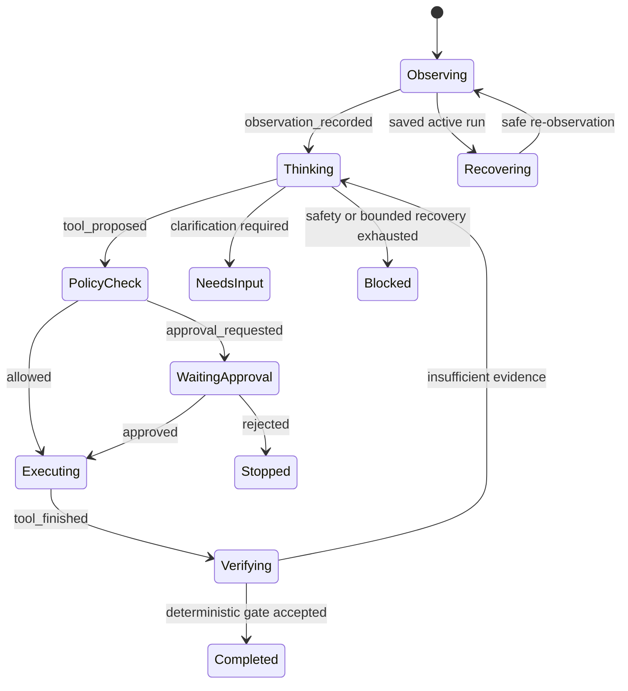

# Agent Runtime v2

Agent Runtime v2 is the default orchestration path for the built-in browser agent. It keeps the existing DOM observer, execution bindings, browser-native input, collection engine, MCP integration, approval UI, and verifier contracts, but replaces blind pre-routing and stateless model calls with a durable evidence-driven loop.

## Runtime boundary

The runtime owns the task lifecycle. A model proposes typed decisions; it does not decide whether an HTTP success means the browser goal succeeded.



The general sequence is:

1. Create and persist a run before any model request.
2. Start observing the current tab and register runtime-issued evidence.
3. In fast approval mode, optionally run a compact instruction router in parallel with the observation. Accept only a high-confidence direct, answer, or collection contract.
4. For a remembered successful direct route, skip the router but re-resolve the semantic target from the live page.
5. Resolve or update the immutable goal contract from the user turn.
6. Select relevant tool schemas under a description budget when the general planner is required.
7. Ask the selected planner for the next typed decision.
8. Apply deterministic and independent policy checks.
9. Collect approval when the proposed effect requires it.
10. Mark the effect pending, execute it once, and normalize its outcome.
11. Re-observe when page state may have changed.
12. Apply the exact local grounding/completion gate; invoke an independent verifier only for ambiguous or external evidence.
13. Accept a terminal result only when the deterministic completion gate passes.

The v2 compact router is not an execution shortcut: it receives no page dump, selector, ref, approval state, or execution binding. Its semantic route is accepted only above the runtime confidence threshold and is then resolved against current evidence. The separate `agentRuntimeVersion: "v1"` setting retains the legacy routed runtime as a rollback path.

## Modules

| Module | Responsibility |
| --- | --- |
| `agent-v2/runtime.js` | Goal normalization, event reducer, pending-effect tracking, evidence/effect/attempt ledgers, context selection, completion gate |
| `agent-v2/provider-driver.js` | Provider-specific request history, stateless Responses replay, screenshot compaction, partial-response recovery |
| `agent-v2/latency-strategy.js` | Latency modes, stage classification, adaptive output/continuation budgets, fast/primary routing and escalation, native decision tool, exact local terminal gate, run latency summaries |
| `agent-v2/tool-registry.js` | Dynamic relevance ranking and bounded schema exposure |
| `agent-v2/run-store.js` | Serialized local persistence and active-run lookup |
| `panel.js` | Observation, planning loop, approval UI, execution coordination, verification, recovery |
| `background.js` | Provider calls, request compatibility negotiation, durable run message API |

All modules are provider- and site-neutral. Page recognition remains based on current semantic DOM, accessibility, geometry, and visual evidence rather than hostname rules or fixed selectors.

## Event-sourced state

A run is reconstructed by reducing idempotent events. Important event types include:

- `run_started`
- `goal_updated`
- `observation_recorded`
- `model_output_received`
- `provider_state_updated`
- `tool_proposed`
- `policy_decided`
- `approval_requested` and `approval_resolved`
- `tool_started` and `tool_finished`
- `completion_checked`
- terminal and recovery events

Each event has a stable ID. Applying the same event twice leaves the reduced state unchanged. Local writes are serialized so two updates cannot overwrite one another with stale snapshots.

The stored state contains redacted goal, provider continuation, current document binding, evidence, attempts, successful effects, unresolved approvals or effects, and terminal status. Password-, secret-, authorization-, key-, cookie-, and payment-like fields are redacted before storage.

## Goal, transport, effect, and completion

The goal contract distinguishes three deliverables:

- `answer`: return a grounded result;
- `effect`: change browser or external state;
- `collection`: return records that satisfy every supplied count and source-page boundary, plus any requested local artifacts.

Tool results are normalized into separate layers:

```json
{
  "transport": {
    "dispatched": true,
    "acknowledged": true
  },
  "effect": {
    "changed": false,
    "kind": "none"
  },
  "goal": {
    "satisfied": false
  },
  "evidence": []
}
```

This prevents `ok: true`, a completed network call, DOM revision noise, or a model-authored success message from being treated as proof of task completion.

## Completion gate

The runtime always makes the final deterministic decision. Exact current-page answers and exact effects can supply a deterministic verifier record without a second model request. Ambiguous semantic claims, external tool results, and evidence that cannot be proven from exact runtime bindings still go to the independent verifier. Completion is rejected when:

- an approval is pending;
- an effect has an unknown execution outcome;
- cited evidence was not issued by the runtime;
- the verifier did not accept the candidate;
- an effect goal lacks a successful action or tool result;
- an answer lacks grounding;
- the latest page observation is required but not bound;
- a collection lacks its runtime result, any requested exact unique count, contiguous coverage of every requested source-page ordinal, or a requested CSV/XLSX artifact;
- the goal still requires clarification.

Evidence selection is task-specific. A tool-only result does not inherit an unrelated current-page observation. A current-screen claim cannot cite an older viewport. Earlier action or tool effects remain available when later observations replace stale visual evidence.

## Provider continuation

Provider state is isolated by purpose so planner reasoning does not leak into policy or verifier conversations:

- `planner`
- `fast-planner`
- `policy`
- `verifier`
- `visual`
- `legacy-router`

For OpenAI Responses, the extension keeps `store: false` and manually replays the channel's input and output items. Planner and repair decisions use one strict `browser_agent_step` function. The runtime executes the proposed effect and appends one `function_call_output` with the exact original `call_id`, normalized results, and runtime evidence IDs before the next user observation. `parallel_tool_calls` is disabled for this decision tool. A focused discovery decision receives a control acknowledgement before the next planner turn. A terminal decision is left terminal when the run ends; if semantic verification rejects it, the original call ID instead receives a `needs_revision` result before repair or replan.

The driver requests `reasoning.encrypted_content`, preserves output reasoning and coherent function-call/result pairs, removes screenshots from older user items, and retains recent state under an adaptive character budget. When compaction is required, it prepends a redacted semantic summary containing the immutable objective, current document, recent effects and attempts, issued evidence IDs, and collection state. It never retains an orphaned function call or output.

Responses events are consumed as SSE. The panel reports connection and received-character progress, while partial structured JSON remains hidden until the terminal response is available. The request audit records first-byte time separately from full duration.

Fast OpenAI Responses stages request low reasoning effort and low text verbosity. A stable prompt-cache key is derived from runtime version, stage, model role, and response schema; it contains no prompt, page text, URL, or site identity. Priority processing is opt-in. Compatible endpoints retain independent guarded fallbacks for streaming, native decision tools, encrypted-reasoning inclusion, reasoning effort, text verbosity, prompt-cache keys, Priority processing, and structured output. An explicitly named unsupported feature is removed alone; an unnamed compatibility error removes the optional latency-hint bundle in one retry while keeping structured output and native tools. Confirmed incompatibilities are cached by endpoint, profile, and model for the lifetime of the background worker.

Chat Completions and Anthropic-compatible profiles keep channel-local user and assistant messages. System instructions are supplied fresh for the current stage.

A stage-specific `maxOutputTokens` overrides the global default. Its value is derived from the response schema, prompt size, and work type, capped by the configured global maximum. If a Responses result is incomplete only because `max_output_tokens` was exhausted, the driver calculates one larger bounded budget using both the configured ceiling and observed output usage. Any other incomplete or non-terminal response fails closed.

## Latency routing and call budgets

The latency strategy distinguishes answer, planner, repair, visual, routing, policy, and verifier work:

| Stage | Model | Normal behavior |
| --- | --- | --- |
| Compact instruction router | Optional fast model | Runs beside initial observation in fast approval mode; only high-confidence bounded routes are accepted |
| Ordinary DOM planner | Optional fast model in fast approval mode, otherwise primary | Low reasoning/verbosity fast pass; uncertainty and primary-only effects escalate |
| Repair or replan | Primary | Full-quality correction budget; never downgraded merely because “grounding” appears in its name |
| Visual verification | Primary | Keeps the vision-capable model and screenshot binding |
| Focused answer | Optional fast model | Uses a compact current-page evidence packet |
| Policy | Optional fast model | Runs only when deterministic policy cannot decide safely |
| Grounding/completion verifier | Optional fast model | Runs only when exact local evidence cannot settle the claim |
| Target arbitration | Optional fast model | Runs only when local semantic scoring cannot prove one candidate |

The expected fast paths are:

| Task shape | Target model calls |
| --- | ---: |
| Recalled successful simple route | 0 |
| First simple direct action through compact routing | 1 |
| Focused answer through compact routing | 2 small fast calls |
| Direct answer through the general planner | 1 |
| Simple page effect through the general planner | 2 |
| Bounded collection after runtime handoff | Initial planning only; later start-page alignment, pagination, extraction, and export are local |
| Ambiguous, sensitive, external, or malformed work | Fast-path budget plus the required policy, verifier, visual, or repair escalation |

Successful direct routes are stored locally under a hash of the exact normalized instruction and page identity, with bounded age and count. Only intent and semantic target fields are retained. Reuse still performs live DOM resolution, policy, approval, current preconditions, native input, outcome verification, and immediate invalidation on failure. If initial observation already contains exactly one target matching every semantic query and role term, its verified snapshot is reused instead of collecting the same viewport twice.

These budgets do not bypass approval, effect normalization, or the completion gate. Run records also preserve `firstDecisionReadyMs`, `firstApprovalReadyMs`, `firstEffectStartedMs`, `firstEffectCompletedMs`, `completedMs`, and wall-clock duration so provider delay can be separated from policy work, user approval, local observation, and browser-settle time.

## Context and tool selection

Context is assembled under a token budget. Unresolved state, explicitly cited evidence, recent effects, and current observations rank above stale narrative. Oversized history is omitted or compacted instead of truncating the goal or pending-effect state.

The tool registry similarly ranks tools against the current goal and planner hints. It exposes only schemas that fit the configured tool count and character limits. When a useful capability appears only in the omitted name index, the read-only `runtime.search_tools` meta-tool accepts a semantic query and optional exact omitted names, then promotes the matching schemas into the next planning turn without executing them. Runtime collection/export, provider tools, and dynamically discovered MCP tools use the same selection contract; no website-specific tool list is embedded in the runtime.

## Recovery

When the panel opens, it asks the background worker for an active run for the current tab:

- A run with no unresolved effect is re-observed before planning resumes.
- A pending approval from an earlier UI lifetime is not approved or executed automatically; the run moves to `needs_input`.
- An effect recorded as started without a finished outcome is never replayed because the first attempt may have reached the browser or external system. The run moves to `needs_input`.
- Terminal runs are not resumed.

This is at-most-once recovery for state-changing effects. Re-observation may prove the goal already succeeded, but uncertainty never authorizes duplicate execution.

## Verification

The local regression suite covers:

- event reduction, idempotency, persistence ordering, and recovery;
- answer, effect, collection, and pending-effect completion gates;
- provider history replay and reasoning-item retention;
- partial-response recovery and compatibility fallback;
- streamed native function calls, exact call-ID continuation, coherent compaction, and compatibility caching;
- latency modes, fast-planner escalation, zero-call semantic route replay, prefetched-observation reuse, adaptive stage budgets, deterministic terminal fast paths, first-effect milestones, and call-budget percentiles;
- token-budgeted context and dynamic tool selection;
- v2 default dispatch without the legacy router;
- real-Chromium observation, frames, native input, approvals, visual surfaces, files, tabs, worker restart, and authenticated Bridge behavior.

Use the repository scripts:

```bash
pnpm run check
pnpm test
pnpm run test:latency
pnpm test:bridge
pnpm test:e2e
```

Live provider calls are intentionally not part of the deterministic local suite. They require a user-configured endpoint and credentials and should be evaluated separately for task success, false completion, approval correctness, latency, and token cost.
