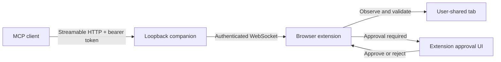

# Local MCP companion

The local companion lets an MCP-capable development tool propose browser actions through this extension. It does not give the MCP client a raw browser-debugging connection. The extension remains the enforcement point: the user chooses one tab, observations are redacted, action input is schema-checked, policy and safety rules run independently, approvals are bound to the observed document, and the page is observed again immediately before execution.



## Requirements

- Node.js 20 or later
- A Chromium-based browser with this repository loaded as an unpacked extension
- An MCP client that supports Streamable HTTP and request headers
- Loopback access between the MCP client, companion, and browser

Install the companion dependencies from the repository root:

```bash
pnpm install
```

## Start with a dynamically selected port

Start the companion without a port to let the operating system select an available loopback port:

```bash
node bridge/server.mjs
```

For scripts that need machine-readable startup data, request one JSON object instead:

```bash
node bridge/server.mjs --json
```

The normal output contains these values:

| Output | Consumer | Purpose |
| --- | --- | --- |
| `MCP endpoint` | MCP client | Streamable HTTP endpoint ending in `/mcp` |
| `Extension endpoint` | Extension Bridge settings | WebSocket endpoint ending in `/extension` |
| `MCP bearer token` | MCP client only | Authorizes requests to the HTTP endpoint |
| `One-time pairing code` | Extension Bridge settings only | Creates an extension credential; it is short-lived and consumed once |
| `Pairing code expires` | User | Exact expiry time for the current pairing code |
| `State file` | Local administrator | Protected file that persists the broker identity, MCP token, and hashed extension credential records |

Treat the bearer token as a local secret. Do not paste it into the extension endpoint or pairing-code field, put it in a URL, commit it, or include it in logs. The pairing code is not an MCP credential.

The default port is ephemeral and can change each time the companion starts. Either update the MCP and extension endpoints from the new output, or supply a private local port through a CLI placeholder or environment variable:

```bash
node bridge/server.mjs --port <LOCAL_LOOPBACK_PORT>
```

```bash
export MY_ASSISTANT_BRIDGE_PORT="<LOCAL_LOOPBACK_PORT>"
node bridge/server.mjs
```

The companion also accepts the following startup controls. Values shown in angle brackets are placeholders, not defaults to copy literally.

| CLI option | Environment variable | Meaning |
| --- | --- | --- |
| `--host <LOOPBACK_HOST>` | `MY_ASSISTANT_BRIDGE_HOST` | Loopback host to bind; non-loopback values are rejected |
| `--port <LOCAL_LOOPBACK_PORT>` | `MY_ASSISTANT_BRIDGE_PORT` | Port to bind; omit it or use `0` for dynamic selection |
| `--state <ABSOLUTE_FILE>` | `MY_ASSISTANT_BRIDGE_STATE_PATH` | Exact state-file location |
| `--state-dir <ABSOLUTE_DIRECTORY>` | `MY_ASSISTANT_BRIDGE_STATE_DIR` | Directory in which the default state filename is created |
| `--pairing-ttl-ms <MILLISECONDS>` | — | Lifetime of the startup pairing code |
| `--tool-timeout-ms <MILLISECONDS>` | — | Companion-to-extension request timeout |

By default, state is stored in the operating system's per-user application-state location. On macOS this is under `~/Library/Application Support/my-assistant-web-plugin`; on Linux it uses `$XDG_STATE_HOME/my-assistant-web-plugin` when configured and otherwise `~/.local/state/my-assistant-web-plugin`; on Windows it uses `%LOCALAPPDATA%\my-assistant-web-plugin`. The companion restricts the state directory and file permissions where the platform supports POSIX modes.

## Pair the extension and share a tab

Initial pairing and routine reconnection are separate operations:

1. Keep the companion running and copy its `Extension endpoint`.
2. Open the extension side panel, then open **Settings → Bridge**.
3. Paste the endpoint into **Bridge endpoint**.
4. Paste the current `One-time pairing code` into its field and select **페어링 (Pair)**. Pairing enables the bridge and stores the endpoint; the code itself is cleared and is not saved in settings.
5. Open the page that the development tool may control.
6. Return to the Bridge settings and select **현재 탭 연결 (Connect current tab)**.
7. Confirm that the header badge says the bridge is connected and the tab is shared.

After a successful pairing, the extension can authenticate on later connections without another pairing code. The extension credential is scoped to the exact endpoint and extension origin. It remains in browser session storage by default; it moves to persistent browser storage only when **인증 값을 이 브라우저에 영구 저장 (Persist authentication values in this browser)** is explicitly enabled.

Use **연결 해제 (Disconnect)** to stop the WebSocket while retaining the pairing, **탭 연결 해제 (Disconnect tab)** to end external sessions and remove access to the tab, and **연결 권한 폐기 (Revoke connection permission)** while connected to invalidate the current pairing credential. Detach the tab as soon as the external task is complete.

## Configure an MCP client

Configuration filenames and secret-input mechanisms vary by client. In every case, use the current startup output rather than assuming a port, keep the companion running, and send the bearer token only in the `Authorization` header.

```bash
export MY_ASSISTANT_MCP_URL="<MCP_ENDPOINT_FROM_STARTUP>"
export MY_ASSISTANT_MCP_TOKEN="<MCP_BEARER_TOKEN_FROM_STARTUP>"
```

The resulting MCP entry needs these values:

| Setting | Value |
| --- | --- |
| Transport | Streamable HTTP |
| URL | Current `MCP endpoint`, ending in `/mcp` |
| Header | `Authorization: Bearer <MCP_BEARER_TOKEN_FROM_STARTUP>` |
| Tool approval | Keep write approval enabled; extension approval is an additional independent layer |
| Tool timeout | At least 60 seconds for user-approved operations |

### TOML-based client pattern

For a client that reads a bearer token from an environment variable, adapt this server table to the client's documented configuration location:

```toml
[mcp_servers.my_assistant_web]
url = "<MCP_ENDPOINT_FROM_STARTUP>"
bearer_token_env_var = "MY_ASSISTANT_MCP_TOKEN"
default_tools_approval_mode = "writes"
tool_timeout_sec = 60
```

The key names are a pattern, not a universal MCP configuration standard. Confirm them against the selected client's documentation. Restart the client after changing the environment or configuration, then use its MCP server inspector to verify that the server is connected. If the companion selects a new port after a restart, update `url` before reconnecting.

### JSON-based client pattern

Some MCP clients accept a JSON server map and expand environment variables in HTTP URL and header fields. For those clients, a project configuration can keep the endpoint and secret out of the file:

```json
{
  "mcpServers": {
    "my-assistant-web": {
      "type": "http",
      "url": "${MY_ASSISTANT_MCP_URL}",
      "headers": {
        "Authorization": "Bearer ${MY_ASSISTANT_MCP_TOKEN}"
      }
    }
  }
}
```

Use this only when the selected client documents both the `mcpServers` shape and `${VARIABLE}` expansion. Otherwise use that client's user-level secret store or prompted-input feature. Start the client from an environment in which both variables are set, approve project configuration only when the file is trusted, and verify the connection in the same process that will run the browser task. A process that started before the MCP configuration changed may need to be restarted.

### Verify a compatible local CLI with a vLLM endpoint

The optional integration scenario accepts the executable path through `LOCAL_HARNESS_BIN`. The executable, or a private wrapper around it, must support the CLI options used by the test and emit newline-delimited `stream-json` events. It should already route its `default` model alias to the intended local vLLM endpoint. The scenario launches a temporary browser profile, pairs the real extension with a temporary companion, sends a natural-language browser task, approves only the fixture's non-sensitive fill operation, and verifies both the CLI event stream and final page value:

```bash
LOCAL_HARNESS_BIN="<COMPATIBLE_CLI_OR_WRAPPER>" pnpm run test:e2e:local-harness
```

The test MCP configuration and bearer token live in a mode-`0600` temporary file and are deleted with the temporary profile. The scenario does not add or replace the user's persistent MCP configuration.

The test fails unless the CLI initializes with model alias `default`, connects the temporary MCP server, calls the complete browser workflow, omits hidden and offscreen fixture facts from its final answer, and leaves the input with the generated per-run value. The ordinary `test:e2e` command remains provider-independent.

For manual state-changing tests, prefer an interactive client conversation. The extension deliberately returns `waiting_approval` until the user reviews the exact effect. After approving it in the side panel, continue the same conversation and ask the client to poll the existing operation, verify the new page state, and close the browser session. A one-shot process may finish at the human-approval boundary and cannot receive that follow-up turn.

## Tool workflow

The companion advertises a small workflow-oriented tool set rather than a general browser protocol:

| Tool | Purpose |
| --- | --- |
| `browser_status` | Check whether an authenticated extension and user-shared tab are available |
| `browser_session_start` | Acquire a short-lived lease for the shared tab and declare the user's goal |
| `browser_observe` | Return a redacted snapshot and a new observation identifier |
| `browser_screenshot` | Capture the visible pixels of the shared tab; the image can contain on-screen private data |
| `browser_execute` | Propose actions bound to the latest observation and an idempotency key |
| `browser_operation_get` | Poll an operation that is waiting for approval or retrieve sanitized evidence |
| `browser_session_close` | Release the external session without changing pairing or tab sharing |

A reliable client sequence is:

1. Call `browser_status` and ask the user to connect and share a tab if it is unavailable.
2. Call `browser_session_start` with the user's browser goal.
3. Call `browser_observe` and plan only from the returned snapshot.
4. Call `browser_execute` with the same `session_id`, the latest `observation_id`, a caller-generated `idempotency_key`, and one or more schema-valid actions. The extension reuses the canonical goal stored by `browser_session_start`; callers cannot replace or paraphrase it during execution.
5. If the operation is `waiting_approval`, tell the user to review the extension. Poll `browser_operation_get` with the returned operation identifier; do not submit a duplicate proposal with a new key.
6. After completion, use the returned post-execution evidence or observe again before proposing another effect.
7. Call `browser_session_close` and ask the user to detach the tab when the task is finished.

Element references are observation-scoped. Any new observation, document navigation, or detected DOM change can invalidate a prior reference. When an operation is reported as stale, observe again and construct a new proposal instead of retrying the old target.

The externally available action schema is derived from the extension's current action contract. It covers bounded page interactions such as click, fill, select, focus, hover, submit, key press, scroll, navigation, waits, extraction, and opening a tab. It intentionally does not expose arbitrary browser APIs, shell commands, local files, uploads, downloads, or unrestricted tab management.

## Approval and safety model

MCP tool approval in the development tool and effect approval in the extension are separate layers. Disabling or approving a prompt in the development tool does not bypass extension policy.

- The companion binds only to a loopback host and rejects non-loopback peers, unexpected `Host` headers, browser-origin HTTP calls, invalid extension origins, and unexpected WebSocket paths.
- The MCP endpoint requires a bearer token in the `Authorization` header. The WebSocket uses a different origin-bound credential in its first authenticated message; credentials are never accepted from query strings.
- Only one user-selected tab is armed. External sessions are short-lived, and detaching or changing the shared tab closes them.
- Page content and MCP input are untrusted. Callers cannot supply their own policy verdict, approval grant, tab ID, safety result, or execution preconditions.
- Observations redact sensitive values. Fill values and other execution material are not returned in public operation status.
- Structured observations are redacted and limited to text and controls visually exposed in the current viewport. Browser-wide tab and download inventories, unrelated page metadata, and stable browser identifiers are removed from external observations. Screenshots are pixel captures and can contain private information already visible on the shared tab, so clients should request them only when the user's task needs visual evidence.
- Every proposal is schema-checked and evaluated by extension policy and deterministic safety rules. Sensitive-data handling can be blocked outright.
- When **상태 변경 작업 전 항상 승인 (Always approve before state-changing work)** is enabled, state-changing proposals wait in the extension. Turning it off does not suppress approvals required by policy or sensitive targets.
- An approval is bound to the operation digest, observation, document, target tab, and expiry. Approval cannot be replayed for a different action.
- Immediately before committing an approved operation, the extension obtains a fresh observation and compares target fingerprints. A changed document or target produces a stale result instead of executing the old action.
- Idempotency keys prevent a network retry from duplicating the same effect. Reusing a key for a different proposal is rejected.
- A service-worker restart never blindly retries an operation whose execution outcome is unknown.

This design reduces accidental or injected actions, but it does not make every website automatable. Browser permission prompts, payment confirmation, CAPTCHA, closed shadow roots, cross-origin frames, and browser-internal pages can still require direct user interaction or remain unavailable.

## Troubleshooting

### `401 Authentication required`

Confirm that the client sends `Authorization: Bearer <MCP_BEARER_TOKEN_FROM_STARTUP>`. Restart the MCP client if its environment was set after the client launched. Do not use the one-time pairing code as the bearer token.

### `Invalid Host header` or `Forbidden`

Copy the exact endpoint printed by the companion. Do not change `127.0.0.1` to another hostname, route it through a proxy, or call it from page JavaScript. The companion deliberately validates the bound host, selected port, peer address, and request origin.

### MCP tools are visible, but every call says the extension is disconnected

The HTTP server can describe its tools even when no extension is authenticated. Open **Settings → Bridge**, paste the current extension endpoint, and either reconnect an existing pairing or complete a new pairing.

### Pairing code is invalid or expired

Pairing codes are one-time and short-lived. Stop and restart the companion to print a fresh code, then pair before its displayed expiry. A previously paired extension should use **Connect** instead of consuming a new code.

### The bridge is connected, but no tab is available

Bring the intended normal web page to the foreground and select **현재 탭 연결 (Connect current tab)**. Browser-internal and other restricted URLs cannot be attached. Attaching a different tab closes the old external session.

### The client describes a browser call, but no MCP tool is actually invoked

Use the client's MCP inspector inside the same interactive conversation and confirm that the intended bridge server is connected. If the server was registered after the client started, exit that process and launch a new one. Text such as an invented tool name or an empty tool block is model output, not proof that the bridge received a call; the client event stream or the extension's external-session indicator must show the real invocation.

### `The shared tab already has an active external-control session`

Only one external lease may control the shared tab. Ask the current client to call `browser_session_close`, detach and reattach the tab, or wait for the abandoned short-lived session to expire.

### Operation remains `waiting_approval`

Open the extension side panel and review **외부 도구 실행 승인 (External tool execution approval)**. Approve or reject the displayed actions there, then continue the same interactive client conversation and poll `browser_operation_get` using the existing operation ID. Do not create a second operation to work around the approval gate. Navigation to a previously ungranted origin can also trigger a separate Chrome site-access prompt; only the user should decide whether to grant that origin permission.

### Operation is `stale`

The page, document, URL, or target fingerprint changed after the client observed it. Call `browser_observe` again and submit a newly planned operation with a new idempotency key.

### The endpoint changes after every restart

This is expected when the port is omitted. Copy the new startup endpoints into the extension and client, or select an available local port outside the repository and provide it with `--port` or `MY_ASSISTANT_BRIDGE_PORT`. Never commit the selected endpoint together with its bearer token.

### Pairing was revoked or the state file changed

Start the companion, use its newly printed pairing code, and pair again. If the state file was intentionally moved, make sure subsequent starts use the same `--state` or `MY_ASSISTANT_BRIDGE_STATE_PATH`; otherwise the companion creates a new broker identity and credentials.
