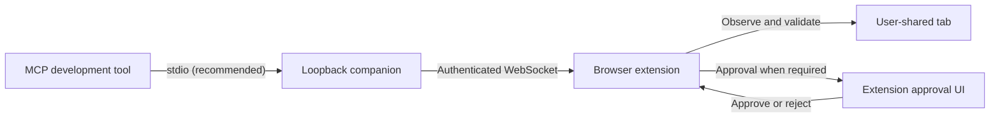

# Local MCP companion

The local companion lets an MCP-capable development tool work with one browser tab explicitly shared through the extension. The default setup uses standard `stdio`, one extension setup value, and a guided four-step tool loop. Session IDs, observation IDs, operation IDs, and idempotency keys stay inside the extension instead of being copied between model calls.



The companion does not expose a raw browser-debugging connection. The extension remains the enforcement point: it limits access to one user-selected tab, redacts observations, validates action schemas and target preconditions, applies policy rules, and handles approval immediately before an effect.

## Requirements

- Node.js 20 or later
- A Chromium-based browser with this repository loaded as an unpacked extension
- An MCP client that supports local `stdio` servers, or Streamable HTTP as a fallback
- Loopback access between the MCP client, companion, and browser

Install dependencies once from the repository root:

```bash
pnpm install
```

## Recommended setup: stdio

Generate a generic MCP server entry using the Node.js executable and bridge file detected on the current machine:

```bash
pnpm run bridge:config
```

The command prints JSON shaped like this, with real absolute paths filled in at runtime:

```json
{
  "mcpServers": {
    "my-assistant-web": {
      "command": "<NODE_EXECUTABLE>",
      "args": ["<BRIDGE_SERVER_FILE>", "--stdio"]
    }
  }
}
```

Merge that entry into the development tool's documented MCP configuration. Do not commit the generated machine-specific paths. Restart the development tool so it launches the companion as a child process.

The companion writes human-readable setup information to standard error because standard output is reserved for MCP messages. On the first browser call it also returns the same setup instruction if the extension is not connected:

```text
Extension setup: ws://127.0.0.1:<PORT>/extension#pair=<ONE_TIME_CODE>
```

In the extension side panel:

1. Open the intended normal web page.
2. Open **Settings → Bridge**.
3. Paste the complete `Extension setup` value.
4. Select **연결하고 현재 탭 공유**.

The extension extracts the endpoint and one-time code locally, removes the fragment before storing settings, pairs the connection, requests access to the current site when needed, and shares the current tab. The MCP bearer credential used by the HTTP fallback is not included in this setup value.

The companion remembers the selected loopback port in its protected state file. Restarting the same stdio server normally reuses that port, so an existing extension pairing can reconnect while its browser-side credential remains available. If the remembered port is occupied, the companion selects another free port and prints a new setup value instead of binding outside loopback.

## Guided MCP workflow

The default tool surface is deliberately small:

| Tool | Purpose |
| --- | --- |
| `browser_begin` | Start or resume the caller's task and return the current redacted page snapshot |
| `browser_act` | Propose the next bounded actions using refs from that snapshot |
| `browser_continue` | Read approval status or return a refreshed snapshot after an operation |
| `browser_screenshot` | Capture visible pixels only when visual evidence is necessary |
| `browser_end` | Release the short-lived browser lease |

A development tool should follow this loop:

1. Call `browser_begin` once with the user's complete goal.
2. Plan only from the returned `page` snapshot and its current element refs.
3. Call `browser_act` with the next required action or small action group.
4. Call `browser_continue` after every proposal.
5. If the response is `approval_required`, ask the user to review the extension and call `browser_continue` again after their decision. Do not resubmit the action.
6. Repeat `browser_act` and `browser_continue` until the refreshed snapshot verifies the goal.
7. Call `browser_end` before returning the final answer.

The caller never supplies a session, observation, operation, or retry identifier in this default mode. The extension creates deterministic retry keys from the current observation and proposed effects, prevents a pending proposal from being duplicated, and refreshes the observation between completed actions.

Calling `browser_begin` again with the same goal and MCP client resumes the current snapshot. A different goal must first end the active task. A different MCP client cannot take over an existing guided session.

Element refs remain snapshot-scoped. A refreshed snapshot can assign different refs, so every new action must use only the latest `page` result.

Visible same-origin and permission-granted cross-origin frames can appear with frame-scoped refs. The extension routes those refs to the bound child document and rejects stale frame identities. Hidden or ambiguously mapped frame contents are withheld. The bridge may capture a screenshot for evidence, but it deliberately does not accept raw visual-coordinate actions because its public request does not carry the extension's screenshot-binding and independent-verifier contract.

## Approval behavior

MCP approval in the development tool and effect approval in the extension are independent layers. Approving a tool call in the development tool does not bypass extension policy.

When `browser_act` returns `approval_required`:

1. Open the extension side panel.
2. Review the exact redacted effects and targets.
3. Approve or reject them.
4. Continue the same development-tool conversation.
5. Call `browser_continue`; it reads the existing operation and refreshes the page after a completed or rejected proposal.

The extension re-observes the document and compares target fingerprints immediately before an approved effect. A changed page or control becomes `stale` instead of executing an outdated action. The next `browser_continue` returns a fresh snapshot so the client can reconsider the plan.

## Advanced identifier-based workflow

The previous low-level surface remains available for clients that need explicit transaction control:

```bash
node bridge/server.mjs --print-config --advanced-tools
```

That configuration starts the stdio server with these tools:

- `browser_status`
- `browser_session_start`
- `browser_observe`
- `browser_screenshot`
- `browser_execute`
- `browser_operation_get`
- `browser_session_close`

In this mode the caller must preserve `session_id`, `observation_id`, `operation_id`, and a caller-generated `idempotency_key`. The extension applies the same tab isolation, policy, approval, precondition, and evidence checks in both modes.

## Streamable HTTP fallback

Use this only when a client cannot launch a local stdio MCP server:

```bash
pnpm run bridge
```

The command prints:

- one `Extension setup` value for the extension
- a loopback MCP endpoint ending in `/mcp`
- an MCP bearer token
- the pairing expiry time and protected state-file location

Configure the client to send the token only in the authorization header:

```text
Authorization: Bearer <MCP_BEARER_TOKEN>
```

Generic TOML pattern:

```toml
[mcp_servers.my_assistant_web]
url = "<MCP_ENDPOINT>"
bearer_token_env_var = "MY_ASSISTANT_MCP_TOKEN"
tool_timeout_sec = 60
```

Generic JSON pattern for clients that document environment-variable expansion:

```json
{
  "mcpServers": {
    "my-assistant-web": {
      "type": "http",
      "url": "${MY_ASSISTANT_MCP_URL}",
      "headers": {
        "Authorization": "Bearer ${MY_ASSISTANT_MCP_TOKEN}"
      }
    }
  }
}
```

Configuration keys vary by client. Confirm the exact file location, HTTP transport name, environment expansion, and secret-input mechanism in that client's documentation.

## Companion controls

| CLI option | Environment variable | Meaning |
| --- | --- | --- |
| `--stdio` | — | Serve MCP over standard input/output; reserves stdout for protocol messages |
| `--print-config` | — | Print a machine-specific generic stdio server entry and exit |
| `--advanced-tools` | — | Advertise the identifier-based tool surface instead of guided tools |
| `--json` | — | Print one HTTP startup object; cannot be combined with `--stdio` |
| `--host <LOOPBACK_HOST>` | `MY_ASSISTANT_BRIDGE_HOST` | Loopback host to bind; non-loopback values are rejected |
| `--port <LOCAL_PORT>` | `MY_ASSISTANT_BRIDGE_PORT` | Explicit port; otherwise reuse the remembered port or select a free one |
| `--state <ABSOLUTE_FILE>` | `MY_ASSISTANT_BRIDGE_STATE_PATH` | Exact protected state-file location |
| `--state-dir <ABSOLUTE_DIRECTORY>` | `MY_ASSISTANT_BRIDGE_STATE_DIR` | Directory for the default state filename |
| `--pairing-ttl-ms <MILLISECONDS>` | — | Lifetime of the startup pairing code |
| `--tool-timeout-ms <MILLISECONDS>` | — | Companion-to-extension request timeout |

By default, state is stored in the operating system's per-user application-state location. The companion restricts the state directory and file permissions where POSIX modes are available. The state contains the broker identity, HTTP MCP token, remembered port, and hashed extension credential records. It does not contain page observations or browser credentials.

## Security properties

- The companion binds only to loopback and rejects non-loopback peers, unexpected hosts, browser-origin HTTP calls, invalid extension origins, and unexpected WebSocket paths.
- The `Extension setup` pairing code is carried in a URL fragment. The extension strips it before opening the WebSocket, so it is not sent in an HTTP or WebSocket request target and is never persisted in extension settings.
- Streamable HTTP requires a bearer token. The extension WebSocket uses a separate origin-bound credential.
- Only one user-selected tab is shared. Detaching or changing it closes active external sessions.
- Page content and MCP input are untrusted. Callers cannot supply approval grants, policy verdicts, browser tab IDs, safety results, or execution preconditions.
- Structured observations exclude hidden, offscreen, fully occluded, fully transparent, and unrelated-tab content. Sensitive values and URL parameters are redacted.
- Child-frame content is included only after a fully exposed iframe boundary maps unambiguously to one browser frame; cross-origin content also needs that origin's browser permission.
- Screenshots contain the visible pixels of the shared tab and may include private on-screen information, so clients should request them only when required.
- Every proposal is schema-checked and independently assessed. Sensitive-data handling can be blocked outright.
- Approval grants are bound to the operation digest, observation, document, tab, and expiry.
- A service-worker restart never blindly retries an operation whose execution outcome is unknown.

This design does not make every page automatable. Browser permission prompts, payment confirmation, CAPTCHA, closed shadow roots, ungranted or ambiguous cross-origin frames, visual-only controls, and browser-internal pages can still require direct user interaction or remain unavailable. See [Web structure compatibility](web-compatibility.md) for the complete boundary and diagnostic model.

## Troubleshooting

### The first browser call says the extension is not connected

Copy the complete `Extension setup` value from that error or from the companion's standard-error log. Paste it into **Settings → Bridge** and select **연결하고 현재 탭 공유**, then retry `browser_begin`.

### The setup code is invalid or expired

The code is one-time and short-lived. Restart the MCP server process to generate a fresh setup value. In stdio mode this normally means restarting or reconnecting the configured MCP server in the development tool.

### The bridge is connected but the wrong tab is shared

Bring the intended normal web page to the foreground, open **Settings → Bridge**, and select **현재 탭으로 변경**. Browser-internal and other restricted URLs cannot be shared.

### An operation remains `approval_required`

Approve or reject it in the extension, then call `browser_continue` in the same task. Do not call `browser_act` again for the same proposal.

### A proposal becomes `stale`

Call `browser_continue` to get a fresh snapshot, then plan again using only its refs. The stale proposal is never replayed.

### Another MCP client owns the active task

Ask the owning client to call `browser_end`, select **공유 중지** in the extension, or wait for the short lease to expire. Guided mode deliberately prevents a different client name from taking over the task.

### The remembered port was unavailable

The companion selects another free loopback port and prints a new `Extension setup` value. Paste the new value into the extension once. An explicitly supplied `--port` fails instead of silently changing, which helps managed environments detect configuration conflicts.

### Streamable HTTP returns `401 Authentication required`

Confirm that the client sends the current token as `Authorization: Bearer ...`. The extension setup code is not an MCP bearer credential.

### Tools are listed but no real browser call appears

Verify that the configured MCP server is connected in the same development-tool process and that the extension badge shows a shared tab. Model-generated text that resembles a tool name is not proof of an invocation; use the client's MCP event view or the extension's external-session indicator.
