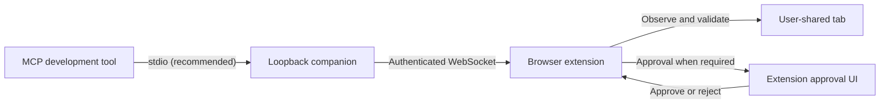

# Local MCP companion

The local companion lets an MCP-capable development tool work with one browser tab explicitly shared through the extension. Bridge protocol `2.3` uses standard `stdio`, one extension setup value, and a guided observe/discover/act/verify loop by default. Session IDs, observation IDs, operation IDs, idempotency keys, and the immutable task intent stay inside the extension instead of being reconstructed between model calls.



The companion does not expose a raw browser-debugging connection. The extension remains the enforcement point: it limits access to one user-selected tab, redacts observations, validates action schemas and target preconditions, applies policy rules, and handles approval immediately before an effect.

## Requirements

- Node.js 20 or later
- A Chromium-based browser with this repository loaded as an unpacked extension
- An MCP client that supports local `stdio` servers, or Streamable HTTP as a fallback
- Loopback access between the MCP client, companion, and browser

Install dependencies once from the repository root:

```bash
npm install
```

If pnpm is installed, `pnpm install` is equivalent. npm is fully supported and uses the transitive dependency overrides declared in `package.json`.

## Recommended setup: stdio

Generate a generic MCP server entry using the Node.js executable and bridge file detected on the current machine:

```bash
npm run bridge:config
```

The command prints JSON shaped like this, with real absolute paths filled in at runtime:

```json
{
  "mcpServers": {
    "my-assistant-web": {
      "command": "<NODE_EXECUTABLE>",
      "args": ["<BRIDGE_SERVER_FILE>", "--stdio"]
    }
  }
}
```

Merge that entry into the development tool's documented MCP configuration. Do not commit the generated machine-specific paths. Restart the development tool so it launches the companion as a child process.

The companion writes human-readable setup information to standard error because standard output is reserved for MCP messages. On the first browser call it also returns the same setup instruction if the extension is not connected:

```text
Extension setup: ws://127.0.0.1:<PORT>/extension#pair=<ONE_TIME_CODE>
```

In the extension side panel:

1. Open the intended normal web page.
2. Open **Settings → 개발 도구**.
3. Paste the complete `Extension setup` value.
4. Select **연결하고 현재 탭 공유**.

The extension extracts the endpoint and one-time code locally, removes the fragment before storing settings, pairs the connection, requests access to the current site when needed, and shares the current tab. The MCP bearer credential used by the HTTP fallback is not included in this setup value.

The companion remembers the selected loopback port in its protected state file. Restarting the same stdio server normally reuses that port, so an existing extension pairing can reconnect while its browser-side credential remains available. If the remembered port is occupied, the companion selects another free port and prints a new setup value instead of binding outside loopback.

## Guided MCP workflow

The default tool surface is deliberately small:

| Tool | Purpose |
| --- | --- |
| `browser_begin` | Start or resume the caller's task and return its immutable intent with the current redacted page snapshot |
| `browser_elements` | Retrieve relevant visible controls by label terms, roles, and nearby context, or continue its opaque cursor |
| `browser_act` | Propose the next bounded actions using refs from that snapshot |
| `browser_continue` | Read approval status or return a refreshed snapshot; `refresh: true` forces a new observation |
| `browser_screenshot` | Capture visible pixels only when visual evidence is necessary |
| `browser_visual_act` | Ask the extension model to locate and verify a described target inside a visual surface |
| `browser_end` | Release the short-lived browser lease |

A development tool should follow this loop:

1. Call `browser_begin` once with the user's complete goal.
2. Read the returned `intent`, then plan only from that boundary and the returned `page` snapshot with its current element refs.
3. If the needed visible control is absent, first call `browser_elements` with a goal-derived `query`, optional `roles`, and optional `near_text`. Continue its `nextCursor` only when more matching results are needed.
4. Use a `scroll` action and observe again when the target is outside the current viewport; element paging covers only controls already visible in that viewport.
5. Call `browser_act` with the next required DOM action or small action group. For an exposed canvas or application surface without a DOM ref, call `browser_visual_act` with only its surface ref and visible target description.
6. Call `browser_continue` after every proposal.
7. If the response is `approval_required`, ask the user to review the extension and call `browser_continue` again after their decision. Do not resubmit the action.
8. Repeat discovery, action, and continuation only while the refreshed snapshot has not met the goal and the returned intent still authorizes the next effect.
9. If an operation returns `failed`, `blocked`, `rejected`, `cancelled`, or `unknown_after_restart`, do not propose another action in that task.
10. Call `browser_end` after completion or a terminal operation and before returning the final answer.

The caller never supplies a session, observation, operation, or retry identifier in this default mode. The extension creates deterministic retry keys from the current observation and proposed effects, prevents a pending proposal from being duplicated, and refreshes the observation between completed actions.

Calling `browser_begin` again with the same goal and MCP client resumes the current snapshot. A different goal must first end the active task. A different MCP client cannot take over an existing guided session.

### Immutable goal and repetition boundary

`browser_begin` resolves the complete goal once, before an action is proposed. The returned object includes an `intent` such as:

```json
{
  "mode": "standalone",
  "objective": "Move to the next page once and report the visible result.",
  "repeatPolicy": "once",
  "repeatLimit": 1,
  "completionCriteria": [
    "The refreshed snapshot shows one page transition and contains the requested visible result."
  ]
}
```

The exact objective and criteria are produced dynamically from the supplied goal. `once` is the safe default. An explicit numeric request can resolve to `bounded` with that count, while a request that names an observable stopping condition can resolve to `until_condition`. The same visible control remaining after a successful action is not permission to repeat it.

The extension records a semantic effect key from the action type, stable target description, and material parameters rather than relying on short-lived refs or action IDs. It checks the limit when an action is proposed and again immediately before execution. This second check prevents two approved or retried proposals from crossing the boundary. If the goal really needs more occurrences, end the current task and begin a new complete goal with an explicit count or stopping condition.

Element refs remain observation-scoped. A refreshed snapshot or element window can assign different refs, so every new action must use only the latest `page` result.

`browser_elements` accepts a structured local search:

```json
{
  "query": "next page",
  "roles": ["button"],
  "near_text": "issue grid"
}
```

The extension evaluates this against currently exposed controls without sending the unfiltered control list back to the caller. It searches accessible names, semantic roles, tags, input types, placeholders, titles, ARIA descriptions, names, test identifiers, and bounded context from the nearest visible cell, row, collection, form, dialog, or region. When the filter allows it, cheap identity matching runs before expensive exposure and nearby-context scoring. Each returned control includes `searchMatch` with its score, matched fields, and a redacted context snippet so the caller can check why it was retrieved.

When both `query` and `near_text` are supplied, the query must match the control's own identity and the nearby text must match its bounded context. Older pagination markup without semantic containers can contribute a small, complete ancestor group, but large ancestor text is rejected. For example, `{ "query": "2", "roles": ["link"], "near_text": "[1/5] [총 484건]" }` returns the literal page link instead of links whose table rows merely contain dates.

`page.elementDiscovery.search` reports the normalized `query`, `roles`, and `nearText`, along with returned and visited counts, matching `total`, `hasMore`, and an opaque `nextCursor`. Broad observations report an exact unfiltered `availableTotal`. An optimized targeted search instead reports `availableTotal: null`, `availableTotalExact: false`, and `potentialTotal`, because it deliberately avoids a second full unfiltered visibility pass; `potentialTotal` is only the inexpensive identity-candidate count, not a claim that every candidate is exposed. The cursor is bound to the complete search filter, document IDs, DOM revisions, frame visibility, viewport position, and the ranked visible-control digest. If any of those change, the runtime discards the old offsets and returns a first window with `cursorReset: true`. A client must not treat the configured element-window size as an accessibility boundary or ask the user to click until relevant searches and visible windows have been exhausted.

Visible same-origin and permission-granted cross-origin `iframe` and legacy `frame` documents can appear with frame-scoped refs. The extension merges their candidates into one visually ordered window, routes actions to the bound child document, and rejects stale frame identities. Named siblings can be distinguished even when they navigate to the same URL; anonymous or otherwise ambiguously mapped frame contents are withheld.

The bridge never accepts raw `visual_click` coordinates. `browser_visual_act` accepts only a current visual-surface ref, a target description, and an optional reason. The extension captures a coherent screenshot, asks the configured model to locate one unambiguous point, runs an independent verification request against the same evidence, and creates the guarded action internally. After approval it repeats that entire resolution against a fresh screenshot and executes only if the document, URL, surface identity, geometry checks, and verifier result still match.

## Approval behavior

MCP approval in the development tool and effect approval in the extension are independent layers. Approving a tool call in the development tool does not bypass extension policy.

When `browser_act` returns `approval_required`:

1. Open the extension side panel.
2. Review the exact redacted effects and targets.
3. Approve or reject them.
4. Continue the same development-tool conversation.
5. Call `browser_continue`; it reads the existing operation and refreshes the page after a completed proposal.

The extension re-observes the document and compares target fingerprints immediately before an approved effect. For a target returned by `browser_elements`, it privately retains and reconstructs the exact search filter and cursor window before checking the ref. A changed page, reordered result set, changed filter binding, or changed control becomes `stale` instead of executing an outdated or rebound action. The next `browser_continue` returns a fresh snapshot so the client can reconsider the plan.

A rejection or execution failure is terminal for the current guided task. `browser_continue` returns that same terminal result with an instruction to call `browser_end`; it does not turn the error into a fresh action opportunity. This prevents a later natural-language message from being merged into the failed task and replaying a relative action such as “next page.”

The same approval behavior applies to `browser_visual_act`. The approval describes the visible target rather than trusting caller-provided coordinates, because the caller is not allowed to provide them.

## Disposable live-page compatibility harness

For a public-page regression outside the synthetic E2E fixture:

```bash
npm run test:live-bridge -- "https://dart.fss.or.kr/dsac001/mainAll.do"
```

The harness creates a temporary extension copy with permission only for the supplied origin, an isolated headless browser profile, a local companion, one shared target tab, and a protected temporary `mcp-client.json`. Use the printed configuration in an MCP test client and run the same guided tools described above.

The harness reads four standard-input commands:

- `status` prints the oldest pending proposal's action types, reasons, and bound target labels.
- `approve` executes that reviewed proposal through the extension.
- `reject` rejects it.
- `quit` terminates Chrome and the companion and removes the temporary profile and client token.

The disposable profile turns off the independent model policy request and the blanket approval setting so compatibility failures can be isolated. Deterministic rules still block sensitive input and still require review for consequential links, navigation, submission, uploads, visual actions, and similar effects. Use this harness only with public pages; it is not a shortcut for a signed-in browser session or the production approval UI.

## Advanced identifier-based workflow

The previous low-level surface remains available for clients that need explicit transaction control:

```bash
node bridge/server.mjs --print-config --advanced-tools
```

That configuration starts the stdio server with these tools:

- `browser_status`
- `browser_session_start`
- `browser_observe`
- `browser_elements`
- `browser_screenshot`
- `browser_visual_act`
- `browser_execute`
- `browser_operation_get`
- `browser_session_close`

In this mode the caller must preserve `session_id`, `observation_id`, `operation_id`, and a caller-generated `idempotency_key`. The extension applies the same immutable intent, semantic repetition boundary, tab isolation, policy, approval, precondition, and evidence checks in both modes.

## Streamable HTTP fallback

Use this only when a client cannot launch a local stdio MCP server:

```bash
npm run bridge
```

The command prints:

- one `Extension setup` value for the extension
- a loopback MCP endpoint ending in `/mcp`
- an MCP bearer token
- the pairing expiry time and protected state-file location

Configure the client to send the token only in the authorization header:

```text
Authorization: Bearer <MCP_BEARER_TOKEN>
```

Generic TOML pattern:

```toml
[mcp_servers.my_assistant_web]
url = "<MCP_ENDPOINT>"
bearer_token_env_var = "MY_ASSISTANT_MCP_TOKEN"
tool_timeout_sec = 60
```

Generic JSON pattern for clients that document environment-variable expansion:

```json
{
  "mcpServers": {
    "my-assistant-web": {
      "type": "http",
      "url": "${MY_ASSISTANT_MCP_URL}",
      "headers": {
        "Authorization": "Bearer ${MY_ASSISTANT_MCP_TOKEN}"
      }
    }
  }
}
```

Configuration keys vary by client. Confirm the exact file location, HTTP transport name, environment expansion, and secret-input mechanism in that client's documentation.

## Companion controls

| CLI option | Environment variable | Meaning |
| --- | --- | --- |
| `--stdio` | — | Serve MCP over standard input/output; reserves stdout for protocol messages |
| `--print-config` | — | Print a machine-specific generic stdio server entry and exit |
| `--advanced-tools` | — | Advertise the identifier-based tool surface instead of guided tools |
| `--json` | — | Print one HTTP startup object; cannot be combined with `--stdio` |
| `--host <LOOPBACK_HOST>` | `MY_ASSISTANT_BRIDGE_HOST` | Loopback host to bind; non-loopback values are rejected |
| `--port <LOCAL_PORT>` | `MY_ASSISTANT_BRIDGE_PORT` | Explicit port; otherwise reuse the remembered port or select a free one |
| `--state <ABSOLUTE_FILE>` | `MY_ASSISTANT_BRIDGE_STATE_PATH` | Exact protected state-file location |
| `--state-dir <ABSOLUTE_DIRECTORY>` | `MY_ASSISTANT_BRIDGE_STATE_DIR` | Directory for the default state filename |
| `--pairing-ttl-ms <MILLISECONDS>` | — | Lifetime of the startup pairing code |
| `--tool-timeout-ms <MILLISECONDS>` | — | Companion-to-extension request timeout |

By default, state is stored in the operating system's per-user application-state location. The companion restricts the state directory and file permissions where POSIX modes are available. The state contains the broker identity, HTTP MCP token, remembered port, and hashed extension credential records. It does not contain page observations or browser credentials.

## Security properties

- The companion binds only to loopback and rejects non-loopback peers, unexpected hosts, browser-origin HTTP calls, invalid extension origins, and unexpected WebSocket paths.
- The `Extension setup` pairing code is carried in a URL fragment. The extension strips it before opening the WebSocket, so it is not sent in an HTTP or WebSocket request target and is never persisted in extension settings.
- Streamable HTTP requires a bearer token. The extension WebSocket uses a separate origin-bound credential.
- Only one user-selected tab is shared. Detaching or changing it closes active external sessions.
- Page content and MCP input are untrusted. Callers cannot supply approval grants, policy verdicts, browser tab IDs, safety results, or execution preconditions.
- Structured observations exclude hidden, offscreen, fully occluded, fully transparent, and unrelated-tab content. Sensitive values and URL parameters are redacted.
- Dense visible controls are exposed through bounded, page-state-bound windows. An element count cap does not become a false capability gap.
- Child-frame content is included only after a fully exposed `iframe` or legacy `frame` boundary maps unambiguously to one browser frame; cross-origin content also needs that origin's browser permission.
- Screenshots contain the visible pixels of the shared tab and may include private on-screen information, so clients should request them only when required.
- Visual actions are located and independently verified inside the extension. External callers cannot provide coordinates, screenshot bindings, policy verdicts, or approval grants, and the target is resolved again after approval.
- Every proposal is schema-checked and independently assessed. Sensitive-data handling can be blocked outright.
- Every session freezes its goal into a repetition policy before execution. Completed semantic effects are counted independently of observation-scoped refs and cannot exceed that policy.
- Failed, blocked, rejected, cancelled, and restart-unknown guided operations are terminal until the caller closes the session.
- Approval grants are bound to the operation digest, observation, document, tab, and expiry.
- A service-worker restart never blindly retries an operation whose execution outcome is unknown.

This design does not make every page automatable. Browser permission prompts, payment confirmation, CAPTCHA, closed shadow roots, ungranted or ambiguous cross-origin frames, ambiguous or protected visual surfaces, and browser-internal pages can still require direct user interaction or remain unavailable. See [Web structure compatibility](web-compatibility.md) for the complete boundary and diagnostic model.

## Troubleshooting

### The first browser call says the extension is not connected

Copy the complete `Extension setup` value from that error or from the companion's standard-error log. Paste it into **Settings → 개발 도구** and select **연결하고 현재 탭 공유**, then retry `browser_begin`.

### `pnpm` is not installed

Use npm:

```bash
npm install
npm run bridge:config
```

pnpm is optional. The Bridge does not require installing or enabling it when npm is already available.

### The setup code is invalid or expired

The code is one-time and short-lived. Restart the MCP server process to generate a fresh setup value. In stdio mode this normally means restarting or reconnecting the configured MCP server in the development tool.

### The bridge is connected but the wrong tab is shared

Bring the intended normal web page to the foreground, open **Settings → 개발 도구**, and select **현재 탭으로 변경**. Browser-internal and other restricted URLs cannot be shared.

### An operation remains `approval_required`

Approve or reject it in the extension, then call `browser_continue` in the same task. Do not call `browser_act` again for the same proposal.

### A proposal becomes `stale`

Call `browser_continue` to get a fresh snapshot, then plan again using only its refs. The stale proposal is never replayed.

### An operation is terminal after an error or rejection

For `failed`, `blocked`, `rejected`, `cancelled`, or `unknown_after_restart`, call `browser_end`. Do not submit another action in the same task. If the user still wants to proceed, start a new `browser_begin` with a complete goal after the old task is closed.

### A repeated action is blocked after one success

Inspect the `intent` returned by `browser_begin`. A standalone goal normally has `repeatPolicy: "once"`, so the same semantic state change cannot run again merely because its button remains visible. End the task and state an explicit count or observable stopping condition in a new goal when repetition is intentional.

### A visible control is missing from `interactiveElements`

Start with `browser_elements` using the best available semantic evidence, for example `{ "query": "next page", "roles": ["button"], "near_text": "issue grid" }`. If the search result reports `hasMore`, continue its `nextCursor` with the same filters. Use an unfiltered cursor only when targeted retrieval cannot identify the control, and use scrolling when the target is outside the current viewport. Do not ask the user to click merely because the first bounded window omitted the control.

### A canvas target has no DOM ref

Use the current entry in `page.visualSurfaces` with `browser_visual_act`. Supply the surface ref and a precise visible description, but no coordinates. Screenshot observation must be enabled in the extension's effective settings, the shared tab must be visible, and the configured model endpoint must accept image input and the structured locator/verifier responses.

### `browser_continue` returns an unchanged page

Pass `{ "refresh": true }` when page content or observation settings may have changed without an operation. The runtime also refreshes automatically when the text limit, element-window size, or redaction setting changes.

### Another MCP client owns the active task

Ask the owning client to call `browser_end`, select **공유 중지** in the extension, or wait for the short lease to expire. Guided mode deliberately prevents a different client name from taking over the task.

### The remembered port was unavailable

The companion selects another free loopback port and prints a new `Extension setup` value. Paste the new value into the extension once. An explicitly supplied `--port` fails instead of silently changing, which helps managed environments detect configuration conflicts.

### Streamable HTTP returns `401 Authentication required`

Confirm that the client sends the current token as `Authorization: Bearer ...`. The extension setup code is not an MCP bearer credential.

### Tools are listed but no real browser call appears

Verify that the configured MCP server is connected in the same development-tool process and that the extension badge shows a shared tab. Model-generated text that resembles a tool name is not proof of an invocation; use the client's MCP event view or the extension's external-session indicator.

### The development tool reports `uv_spawn`, `ENOENT`, or a stop-hook error

These errors normally come from a local hook process that the development tool tried to start, rather than from an MCP Bridge response. Check the hook command, executable permissions, absolute path, and inherited `PATH`, or temporarily disable that hook. Diagnose the Bridge independently by confirming that **Settings → 개발 도구** shows both a connected companion and the intended shared tab, then check whether an actual MCP tool call appears in the client or extension session log.
